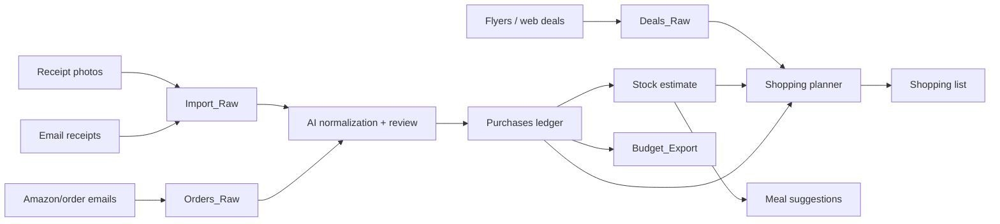
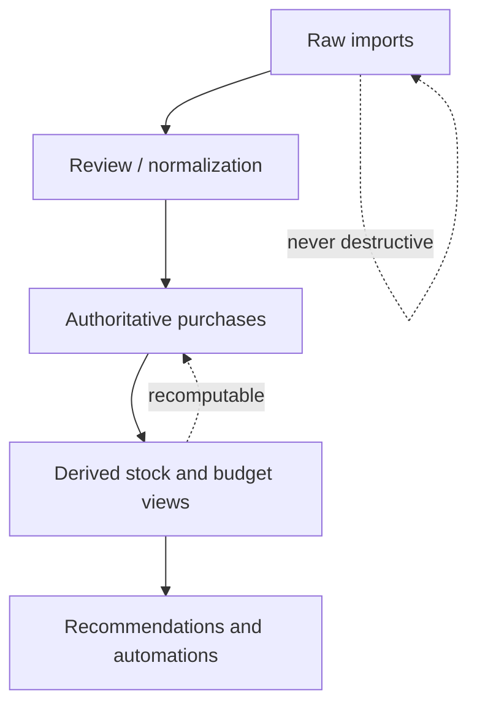
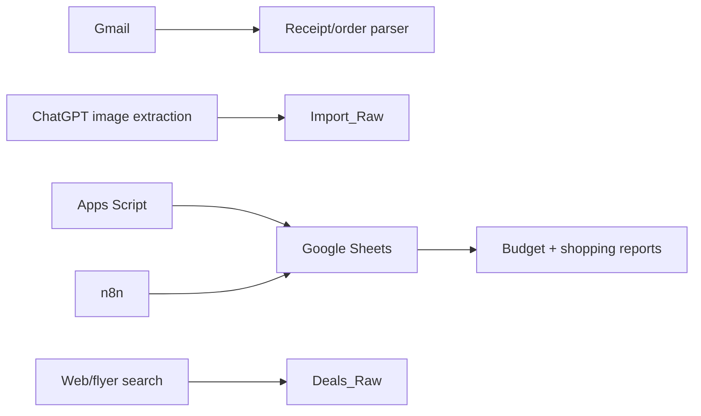

# Shopping Inventory

Low-code, AI-assisted grocery and household inventory system built around receipts, email/order imports, Google Sheets, and conservative automation.

The core idea is simple: receipts and order emails prove acquisition, not possession. The system keeps raw imports immutable, promotes reviewed purchases into an authoritative ledger, estimates current stock probabilistically, and uses that state to support shopping lists, meal planning, deal matching, and budget rollups.

## Use cases

### Receipt ingestion

- Upload grocery receipt photos and extract purchased line items
- Preserve raw receipt text, confidence, and ambiguity
- Append to an import/staging sheet without overwriting inventory
- Deduplicate accidental re-uploads
- Support later correction and normalization

### Grocery purchase ledger

- Track what was bought, when, where, and for how much
- Normalize messy receipt abbreviations into canonical items
- Separate food, household, pet, personal care, pharmacy, and misc retail
- Build monthly grocery and household spend summaries
- Export clean category rollups into a separate budget spreadsheet

### Stock estimation

- Estimate likely pantry/fridge/freezer state from purchase history
- Use coarse states instead of fake precision: `none`, `low`, `available`, `stocked`, `unknown`
- Flag produce and perishables that should be used soon
- Avoid direct mutation from OCR into current inventory

### Shopping lists

- Suggest replenishment based on staple cadence, recent purchases, estimated stock, meal plans, and budget
- Avoid recommending items already likely stocked
- Explain why each item is suggested
- Support store-specific lists later

### Meal planning

- Suggest meals from current estimated inventory
- Prioritize expiring produce and already-owned proteins/staples
- Use web search for recipes when useful
- Avoid nutrition precision the data cannot support

### Deals and flyers

- Ingest flyer/email/web deals into a raw deals table
- Match deals against staples, low-stock items, and planned meals
- Compare current prices against historical purchase prices
- Suppress noisy deals for items already stocked or rarely used

### Non-food household inventory

- Track slower-moving items that are often easier to estimate than fresh food
- Useful categories: cat food/litter, detergent, cleaning supplies, paper goods, toiletries, batteries, pharmacy basics, kitchen supplies
- Support Amazon and other ecommerce receipts through email/order imports

## System model

## Spreadsheet-first architecture

This project starts with Google Sheets as the operating datastore, not a custom app.

Recommended tabs:

| Tab | Purpose |
| --- | --- |
| `Import_Raw` | Append-only receipt OCR/extraction inbox |
| `Orders_Raw` | Append-only email/ecommerce order import inbox |
| `Deals_Raw` | Raw flyer/deal/email promo captures |
| `Purchases` | Reviewed or AI-normalized authoritative purchase ledger |
| `Stock` | Derived/coarse estimate of current inventory |
| `Aliases` | Mapping from raw receipt patterns to canonical items |
| `Budget_Export` | Monthly/category rollups for a separate budget sheet |
| `Review_Queue` | Low-confidence rows requiring human or AI review |

## Data flow principles

- Raw imports are append-only
- OCR/AI output is evidence, not truth
- Purchases are the authoritative ledger
- Stock is derived and probabilistic
- Recommendations must explain their rationale
- Budget exports consume authoritative purchases, not raw imports

## Suggested MVP

1. Create the Google Sheet with the core tabs
2. Upload receipt images to ChatGPT or another AI workflow
3. Append extracted rows to `Import_Raw`
4. Normalize reviewed rows into `Purchases`
5. Generate coarse `Stock` states
6. Produce a weekly shopping list and monthly `Budget_Export`

## Future automation lanes

Potential implementation paths:

- ChatGPT + Google Sheets direct updates for manual/low-code MVP
- Google Apps Script for sheet-native normalization and rollups
- n8n for scheduled Gmail, Amazon/order email, and flyer ingestion
- SQLite or PocketBase later if spreadsheet limits become painful
- Hosted Postgres/Supabase-style platforms remain candidates, not defaults

## Documentation

### Architecture and decisions

- [Architecture](docs/architecture.md)
- [ADR-0001: Spreadsheet-first low-code substrate](docs/decisions/ADR-0001-spreadsheet-first-low-code-substrate.md)
- [ADR-0002: Raw imports are append-only evidence](docs/decisions/ADR-0002-raw-imports-are-append-only-evidence.md)
- [ADR-0003: Coarse probabilistic stock estimation](docs/decisions/ADR-0003-coarse-probabilistic-stock-estimation.md)
- [ADR-0004: Apps Script vs n8n automation](docs/decisions/ADR-0004-apps-script-vs-n8n.md)
- [ADR-0005: Defer backend provider selection](docs/decisions/ADR-0005-supabase-migration-path.md)

### Schemas

- [Sheet schema overview](docs/schema/README.md)
- [Raw import schemas](docs/schema/raw-imports.md)
- [Ledger and derived schemas](docs/schema/ledger-and-derived.md)

### Specifications

- [Normalization pipeline](docs/specs/normalization-pipeline.md)
- [Item aliasing and canonicalization](docs/specs/aliasing-canonicalization.md)
- [Receipt ingestion prompt contracts](docs/specs/receipt-ingestion-prompt-contracts.md)
- [Inventory decay heuristics](docs/specs/inventory-decay-heuristics.md)
- [Recommendation engine architecture](docs/specs/recommendation-engine.md)
- [Budget export mappings and categories](docs/specs/budget-export-mappings.md)

### Research

- [Backend provider requirements and evaluation](docs/research/provider-requirements.md)

### Security and evaluation

- [Threat model and privacy considerations](docs/security/threat-model-and-privacy.md)
- [OCR normalization evaluation corpus](docs/evaluation/ocr-normalization-corpus.md)

## Status

Preliminary architecture and decision documentation. Implementation intentionally starts simple: Google Sheets + AI extraction + reviewable promotion into authoritative purchases.
