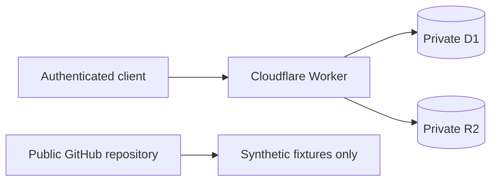
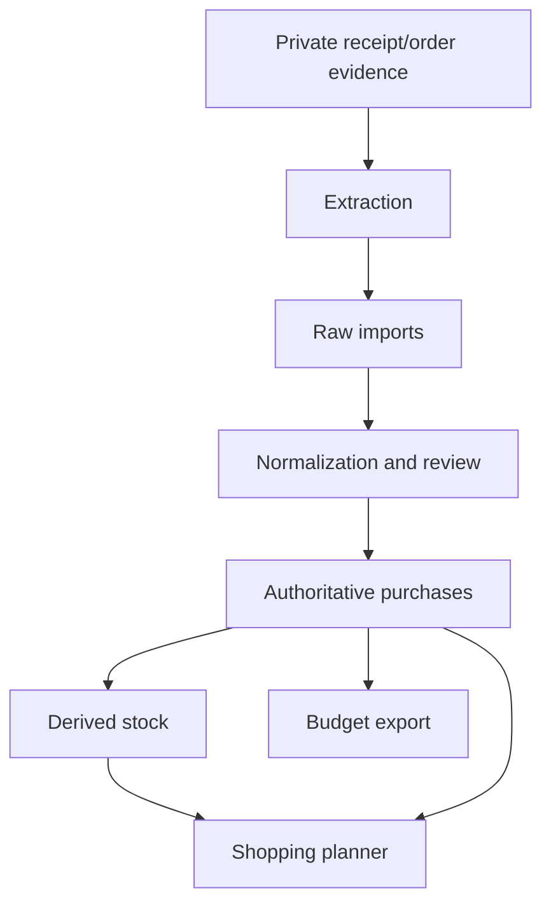

# Shopping Inventory

A personal grocery and household inventory system built around private receipt evidence, reviewed purchase records, conservative automation, and explainable recommendations.

The core model is simple: receipts and order emails prove acquisition, not possession. Raw evidence is preserved privately, reviewed records become authoritative purchases, stock is derived probabilistically, and downstream shopping or budget outputs remain recomputable.

## Privacy boundary

This repository is public and contains only:

- source code;
- migrations and schemas;
- documentation;
- synthetic fixtures and generated test data.

Real receipts, OCR payloads, purchase history, stock state, budget outputs, credentials, and household data must not be committed.

The preferred private operating substrate is:


```mermaid
flowchart LR
  Client[Authenticated client] --> Worker[Cloudflare Worker]
  Worker --> D1[(Private D1)]
  Worker --> R2[(Private R2)]
  Repo[Public GitHub repository] --> Fixtures[Synthetic fixtures only]
```

- **Cloudflare D1** is the authoritative structured datastore.
- **Cloudflare R2** stores private receipt images and large source payloads.
- **Cloudflare Worker** is the authenticated access boundary.
- **Google Sheets** may be used as an optional export or review surface, but is not authoritative.
- **CSV and SQLite-compatible exports** preserve portability and recovery.

See [Private Data Policy](docs/security/private-data-policy.md) and [Private Receipt Storage Runbook](docs/runbooks/private-receipt-storage.md).

## Product principles

- Personal usefulness beats generality.
- Raw extraction is evidence, not truth.
- AI may propose changes but must not silently mutate authoritative state.
- Purchases are the authoritative ledger.
- Stock is derived and probabilistic.
- Ambiguous records route to review.
- Recommendations explain their rationale.
- Provider-specific concerns remain isolated from the domain model.

## Core data flow


```mermaid
flowchart TD
  Evidence[Private receipt/order evidence] --> Extract[Extraction]
  Extract --> Raw[Raw imports]
  Raw --> Normalize[Normalization and review]
  Normalize --> Purchases[Authoritative purchases]
  Purchases --> Stock[Derived stock]
  Purchases --> Budget[Budget export]
  Stock --> Planner[Shopping planner]
  Purchases --> Planner
```

## Current implementation

The repository currently includes:

- n8n ingestion workflows and layered validation tests;
- a Cloudflare Worker storage boundary;
- a D1 migration for receipt evidence metadata and audit events;
- private R2 receipt upload and retrieval paths;
- compensating cleanup when D1 persistence fails;
- synthetic Cloudflare tests;
- privacy-focused Git ignore rules and contribution checks.

The current milestone is **privacy and schema stabilization**:

1. keep all personal data private;
2. audit and remediate existing receipt-derived repository history;
3. finalize versioned canonical contracts;
4. prove one synthetic receipt through the complete vertical slice;
5. add automated schema and privacy validation.

## Repository layout

```text
.github/                 Pull request and CI configuration
automation/n8n/          Conservative ingestion workflows
docs/                    Architecture, policies, schemas, and runbooks
evaluation/              Synthetic regression fixtures
migrations/              D1/SQLite-compatible migrations
src/                     Cloudflare Worker implementation
test/                    Unit, integration, and simulation tests
```

## Development

Requirements:

- Node.js 20 or newer
- npm

Run tests:

```bash
npm test
npm run test:cloudflare
npm run test:n8n:unit
npm run test:n8n:integration
npm run test:n8n:e2e
```

Run the Worker locally with synthetic data:

```bash
npm install
npm run cf:migrate:local
npm run cf:dev
```

Production credentials and Cloudflare resource identifiers must remain outside the repository.

## Documentation

### Privacy and architecture

- [Private Data Policy](docs/security/private-data-policy.md)
- [Threat model and privacy considerations](docs/security/threat-model-and-privacy.md)
- [Cloudflare private storage](docs/architecture/cloudflare-private-storage.md)
- [Private receipt storage runbook](docs/runbooks/private-receipt-storage.md)

### Data contracts and behavior

- [Architecture](docs/architecture.md)
- [Sheet schema overview](docs/schema/README.md)
- [Raw import schemas](docs/schema/raw-imports.md)
- [Ledger and derived schemas](docs/schema/ledger-and-derived.md)
- [Normalization pipeline](docs/specs/normalization-pipeline.md)
- [Receipt ingestion prompt contracts](docs/specs/receipt-ingestion-prompt-contracts.md)
- [Inventory decay heuristics](docs/specs/inventory-decay-heuristics.md)
- [Recommendation engine](docs/specs/recommendation-engine.md)

### Automation and evaluation

- [n8n automation workflows](automation/n8n/README.md)
- [Evaluation fixtures](evaluation/README.md)
- [Next steps](docs/planning/next-steps.md)

## Status

Early implementation. The private Cloudflare storage boundary exists, but production resources have not been provisioned and real personal data must not be added until the privacy audit and operational controls are complete.
