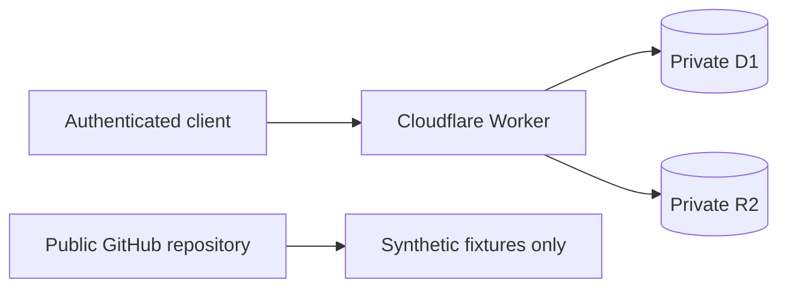
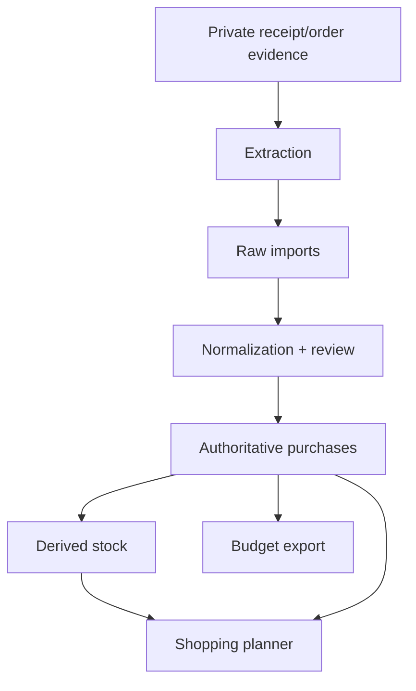

# Shopping Inventory

A personal grocery and household inventory system built around private receipt evidence, reviewed purchase records, conservative automation, and explainable recommendations.

The core model is simple: receipts and order emails prove acquisition, not possession. Raw evidence is preserved privately, reviewed records become authoritative purchases, stock is derived probabilistically, and downstream shopping or budget outputs remain recomputable.

## Privacy boundary

This repository is public and contains only:

- source code;
- migrations and schemas;
- documentation;
- synthetic fixtures and generated test data.

Real receipts, OCR payloads, purchase history, stock state, budget outputs, credentials, and household data must not be committed.

The private operating substrate is:


```mermaid
flowchart LR
  Client[Authenticated client] --> Worker[Cloudflare Worker]
  Worker --> D1[(Private D1)]
  Worker --> R2[(Private R2)]
  Repo[Public GitHub repository] --> Fixtures[Synthetic fixtures only]
```

- **Cloudflare D1** is the preferred authoritative structured datastore.
- **Cloudflare R2** stores private receipt images and large source payloads.
- **Cloudflare Worker** is the authenticated application/API boundary.
- **Google Sheets** may be used as an optional export or review surface, but is not authoritative.
- **CSV and SQLite-compatible exports** preserve portability and recovery.

See [ADR-0006](docs/decisions/ADR-0006-public-code-private-cloudflare-substrate.md), [Private Data Policy](docs/security/private-data-policy.md), and [Private Receipt Storage Runbook](docs/runbooks/private-receipt-storage.md).

## Product principles

- Personal usefulness beats generality.
- Raw extraction is evidence, not truth.
- AI may propose changes but must not silently mutate authoritative state.
- Purchases are the authoritative acquisition ledger.
- Stock is derived and probabilistic.
- Ambiguous records route to review.
- Recommendations explain their rationale.
- Provider-specific concerns remain isolated from the domain model.

## Core data flow


```mermaid
flowchart TD
  Evidence[Private receipt/order evidence] --> Extract[Extraction]
  Extract --> Raw[Raw imports]
  Raw --> Normalize[Normalization + review]
  Normalize --> Purchases[Authoritative purchases]
  Purchases --> Stock[Derived stock]
  Purchases --> Budget[Budget export]
  Stock --> Planner[Shopping planner]
  Purchases --> Planner
```

## Current implementation

The repository includes:

- repository-wide privacy validation and pre-write agent guardrails;
- authenticated Cloudflare Worker receipt evidence and structured staging endpoints;
- private R2 receipt upload/retrieval with opaque keys;
- D1 migrations for evidence, structured raw staging, append-only review/audit events, purchase candidates, and immutable authoritative purchases;
- versioned JSON Schema contracts for receipt → purchase plus derived stock/budget/recommendation outputs;
- database-enforced item-only/approved-only promotion, event-projected review/duplicate state, actor-attributed purchase promotion/correction, exact evidence idempotency, conservative transaction-collision review, and purchase supersession/immutability;
- a deterministic synthetic vertical slice through review, purchase, stock, budget, and explained shopping recommendation;
- layered n8n, Cloudflare, schema, D1, privacy, and vertical-slice CI coverage.

The active milestone is **integrity, security, and operational hardening**:

1. complete cross-ingestion duplicate and reprocessing semantics;
2. complete remaining privacy/supply-chain security controls;
3. provision/operate the private Cloudflare environment with retention and recovery controls;
4. expand evaluation/product behavior only after those authority and operational boundaries are stable.

## Repository layout

```text
.github/                 Pull request and CI configuration
automation/n8n/          Conservative external orchestration
docs/                    Architecture, policies, schemas, decisions, and runbooks
evaluation/              Synthetic regression fixtures
migrations/              D1/SQLite-compatible migrations
schemas/                 Versioned machine-readable contracts
src/                     Worker and deterministic domain implementation
test/                    Unit, integration, contract, D1, and simulation tests
```

## Development

Requirements:

- Node.js 20 or newer
- npm

Install dependencies and run the same repository validation used by the main CI job:

```bash
npm install
npm run validate
```

Focused test commands remain available in `package.json` for local iteration. `npm test` runs every JavaScript test in `test/*.test.mjs`, including the synthetic vertical slice. `npm run content:check` validates relative Markdown links and tracked structured fixtures without network access.

Run the Worker locally with synthetic data:

```bash
npm run cf:migrate:local
npm run cf:dev
```

Production credentials and Cloudflare resource identifiers must remain outside the repository.

## Documentation

### Privacy and architecture

- [Architecture](docs/architecture.md)
- [ADR-0006: private Cloudflare operating substrate](docs/decisions/ADR-0006-public-code-private-cloudflare-substrate.md)
- [Private Data Policy](docs/security/private-data-policy.md)
- [Threat model and privacy considerations](docs/security/threat-model-and-privacy.md)
- [Cloudflare private storage](docs/architecture/cloudflare-private-storage.md)
- [Private receipt storage runbook](docs/runbooks/private-receipt-storage.md)

### Data contracts and behavior

- [Canonical contracts v1](docs/schema/canonical-contracts-v1.md)
- [Sheet/export schema overview](docs/schema/README.md)
- [Raw import schemas](docs/schema/raw-imports.md)
- [Ledger and derived schemas](docs/schema/ledger-and-derived.md)
- [Review and audit events](docs/schema/review-and-audit-events.md)
- [Duplicate and reprocessing policy](docs/specs/duplicate-and-reprocessing.md)
- [Normalization pipeline](docs/specs/normalization-pipeline.md)
- [Receipt ingestion prompt contracts](docs/specs/receipt-ingestion-prompt-contracts.md)
- [Inventory decay heuristics](docs/specs/inventory-decay-heuristics.md)
- [Recommendation engine](docs/specs/recommendation-engine.md)

### Automation and evaluation

- [n8n automation workflows](automation/n8n/README.md)
- [Evaluation fixtures](evaluation/README.md)
- [Next steps](docs/planning/next-steps.md)

## Status

The repository-side architecture and complete synthetic acceptance path are implemented. Production/private Cloudflare resources are not yet provisioned, so real household data must remain in approved private storage/fallbacks until #18 operational controls are complete.
