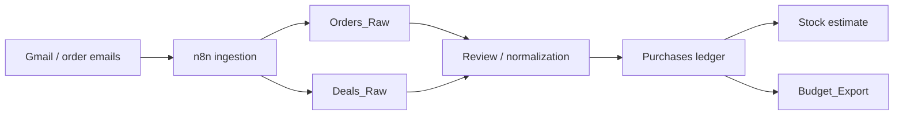

# n8n Automation

This directory contains importable n8n workflows for the personal shopping inventory system.

The initial workflow is deliberately conservative. It collects candidate email/order/deal evidence and appends it to raw Google Sheet tabs. It does **not** promote rows into authoritative purchases, recompute stock, or write budget exports.

## Workflows

| Workflow | File | Purpose |
| --- | --- | --- |
| Shopping inventory ingestion starter | [`shopping-ingestion-starter.n8n.json`](shopping-ingestion-starter.n8n.json) | Search Gmail for candidate order/receipt/deal messages and append raw rows to `Orders_Raw` and `Deals_Raw` |

## Intended boundary

n8n is for external orchestration:

- scheduled Gmail/order ingestion
- deal and flyer capture
- cross-system plumbing
- notifications and summaries later

It should not silently mutate truth.

Authoritative state still belongs behind a review boundary:



## Import

1. Open n8n
2. Choose **Import from file**
3. Import `shopping-ingestion-starter.n8n.json`
4. Configure credentials:
   - Gmail OAuth2
   - Google Sheets OAuth2
5. Update the `Configuration` node:
   - `spreadsheetId`
   - `ordersSheetName`
   - `dealsSheetName`
   - Gmail search queries
6. Run manually first
7. Inspect appended rows in `Orders_Raw` and `Deals_Raw`
8. Enable the weekly schedule only after the output is acceptable

## Required Google Sheet tabs

The starter workflow expects these tabs to exist:

- `Orders_Raw`
- `Deals_Raw`

The columns should match the raw import schemas in `docs/schema/raw-imports.md`.

## Current behavior

### Orders_Raw

The workflow searches Gmail for candidate receipt/order/invoice/shipping messages and appends one conservative raw row per email.

This is intentionally not a full line-item parser yet. The first version preserves evidence and creates reviewable candidates.

### Deals_Raw

The workflow searches Gmail for candidate sale/flyer/coupon/promo/deal messages and appends one conservative raw row per email.

Deals are not purchases. They should only inform shopping recommendations after review or later parsing.

## Configuration defaults

The default Gmail queries are intentionally broad placeholders:

```text
newer_than:14d (receipt OR order OR invoice OR shipped OR delivered) -category:promotions
newer_than:7d (sale OR flyer OR coupon OR offer OR promo OR deals)
```

Tune these once real emails reveal false positives and useful merchant patterns.

Useful future refinements:

- merchant allowlist for groceries and household purchases
- Amazon/order-specific search lanes
- Instacart / Walmart / Costco / Save-On / delivery-service query variants
- exclusion filters for unrelated SaaS invoices
- label processed messages after successful append
- store full raw message payload references outside the sheet

## Tests

Run all repository tests:

```bash
npm test
```

Run only n8n tests:

```bash
npm run test:n8n
```

### Unit tests

```bash
npm run test:n8n:unit
```

Unit tests execute the actual JavaScript embedded in n8n Code nodes with fixture Gmail messages from `test/fixtures/n8n/sample-gmail-messages.json`.

They validate that:

- `Prepare Orders_Raw rows` emits reviewable `Orders_Raw` rows
- `Prepare Deals_Raw rows` emits reviewable `Deals_Raw` rows
- deterministic ids and dedupe keys are stable for the same source messages
- low-confidence raw evidence rows do not look authoritative
- stock or budget state is not emitted by ingestion code

### Integration tests

```bash
npm run test:n8n:integration
```

Integration tests inspect the exported n8n workflow graph and data-contract boundaries.

They validate that:

- workflow JSON can be parsed
- node names and ids are unique
- connection targets exist
- Google Sheets nodes are append-only
- workflows do not write directly to `Purchases`, `Stock`, or `Budget_Export`
- scheduled triggers are disabled in checked-in exports
- Code nodes avoid environment-sensitive imports such as `require(...)`
- exported workflow files do not contain obvious credential material
- the manual-trigger path reaches both raw ingestion lanes

### E2E simulation tests

```bash
npm run test:n8n:e2e
```

The e2e layer is a local simulation, not a live Gmail/Sheets run.

It walks the exported workflow graph from `Manual trigger` and verifies that:

- the terminal write nodes are `Append Orders_Raw` and `Append Deals_Raw`
- external read boundaries are Gmail nodes only
- external write boundaries are Google Sheets append nodes only
- the workflow does not route into authoritative state

This gives useful regression coverage without requiring live credentials or mutating real spreadsheets.

### n8n CLI import smoke test

Run the optional n8n CLI import smoke test after installing n8n:

```bash
npm install -g n8n
npm run test:n8n:import
```

The CLI smoke test imports every `*.n8n.json` workflow under this directory into an isolated local n8n user folder using SQLite. It does not execute external Gmail or Google Sheets calls.

## CI

`.github/workflows/n8n-validation.yml` runs:

1. n8n unit tests
2. n8n integration tests
3. n8n e2e simulation tests
4. n8n CLI import smoke test

The CLI smoke test runs after the faster local tests pass.

## Guardrails

- Do not write directly to `Purchases`
- Do not write directly to `Stock`
- Do not write directly to `Budget_Export`
- Preserve source message references where possible
- Keep parse confidence low for unparsed email candidates
- Keep `review_state` as `new`
- Prefer append-only writes for raw evidence
- Do not hard-code credentials or private sheet IDs in exported workflow files

## Known limitations

- n8n node schemas may vary slightly by n8n version
- Gmail message fields differ depending on node options and account configuration
- Current workflow creates email-level candidate rows, not item-level rows
- Dedupe is represented with a `dedupe_key`, but not enforced by the starter workflow
- Scheduled trigger is disabled by default
- Current e2e test is a local graph/data-boundary simulation, not a live external-system test

## Next workflow candidates

- receipt photo ingestion webhook into `Import_Raw`
- Gmail label-after-success variant
- merchant-specific Amazon/order parser
- weekly shopping summary notification
- deal matching report against staples and low-stock items
- budget export handoff to the separate budget spreadsheet
