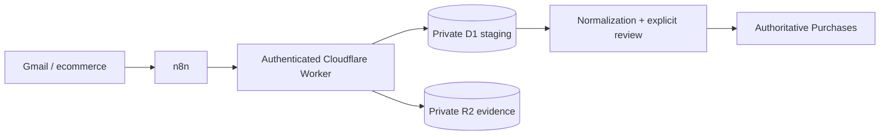

# n8n Automation

This directory contains importable n8n workflows and regression fixtures for external shopping-data orchestration.

## Current architecture boundary

n8n is an **integration/orchestration layer**, not an authoritative datastore.

The current supported private architecture is:


```mermaid
flowchart LR
  Gmail[Gmail / ecommerce] --> N8N[n8n]
  N8N --> Worker[Authenticated Cloudflare Worker]
  Worker --> D1[(Private D1 staging)]
  Worker --> R2[(Private R2 evidence)]
  D1 --> Review[Normalization + explicit review]
  Review --> Purchases[Authoritative Purchases]
```

n8n must not write directly to authoritative `Purchases`, derived `Stock`, or budget/recommendation state. Real message/order content must remain inside approved private systems and must never use public Git as an intermediate.

See [ADR-0006](../../docs/decisions/ADR-0006-public-code-private-cloudflare-substrate.md).

## Checked-in starter workflow

| Workflow | File | Status |
| --- | --- | --- |
| Shopping inventory ingestion starter | [`shopping-ingestion-starter.n8n.json`](shopping-ingestion-starter.n8n.json) | **Transitional/legacy fixture** |

The starter predates the Worker/D1 ingestion boundary. It searches Gmail and appends conservative email-level rows to `Orders_Raw` and `Deals_Raw` Google Sheet tabs.

It remains checked in because it provides useful executable coverage for:

- Gmail message mapping;
- deterministic source IDs/dedupe keys;
- conservative confidence/review defaults;
- n8n graph validation;
- import compatibility;
- proof that orchestration does not write to `Purchases`, `Stock`, or `Budget_Export`.

**Do not treat its Google Sheets writes as the current production ingestion design.** Sheets are optional review/export surfaces under ADR-0006. New real-data ingestion work should target the authenticated Worker/private D1 staging path.

## Transitional workflow usage

The checked-in export is safe for synthetic/local validation. If it is imported into n8n for inspection:

1. use synthetic/test Gmail and Sheet resources;
2. keep scheduled triggers disabled;
3. do not connect production credentials merely to exercise the fixture;
4. do not use its Sheets destination for real household data;
5. preserve its current behavior until a separately reviewed migration replaces it with Worker-based ingestion.

A future executable replacement should map selected Gmail/order evidence into the canonical private ingestion contracts rather than maintaining a second raw-data store.

## Tests

### Unit

```bash
npm run test:n8n:unit
```

Executes the JavaScript embedded in n8n Code nodes against synthetic Gmail fixtures.

It verifies:

- conservative email/order/deal mapping;
- deterministic IDs and source-level dedupe keys;
- low-confidence `new` review state;
- no authoritative/derived output fields.

### Integration

```bash
npm run test:n8n:integration
```

Inspects the exported graph and contract boundaries:

- workflow JSON is valid;
- node names/IDs and connections are coherent;
- checked-in writes are append-only;
- no path writes directly to authoritative or derived state;
- scheduled triggers are disabled;
- exported workflows contain no obvious credential material.

### E2E simulation

```bash
npm run test:n8n:e2e
```

Walks the synthetic/local graph without live Gmail/Sheets access. This validates legacy fixture behavior; it is not evidence that Sheets are an approved real-data substrate.

### CLI import smoke

```bash
npm install -g n8n
npm run test:n8n:import
```

Imports checked-in workflow exports into an isolated local n8n SQLite user folder. It does not execute external integrations.

## Guardrails

- Real household data enters through the authenticated private ingestion boundary, not Git or public CI.
- n8n may orchestrate evidence discovery and transport; it does not own canonical truth.
- Do not write directly to `Purchases`, `Stock`, `BudgetExport`, or recommendations.
- Preserve source references and idempotency inputs.
- Keep ambiguous/low-confidence evidence reviewable.
- Use least-privilege integration credentials.
- Avoid raw private payloads in logs.
- New workflow implementations should call the Worker rather than create another authoritative/raw datastore.

## Known limitations

- The checked-in starter is intentionally transitional and still models Google Sheets append nodes.
- It creates email-level candidate rows, not canonical line-item extraction envelopes.
- Its `dedupe_key` is deterministic but not itself an authoritative duplicate decision.
- The e2e layer is a graph/data-boundary simulation, not a live external-system test.

Replacement/migration work should be tracked as a bounded executable issue rather than silently changing this fixture's architectural meaning.
