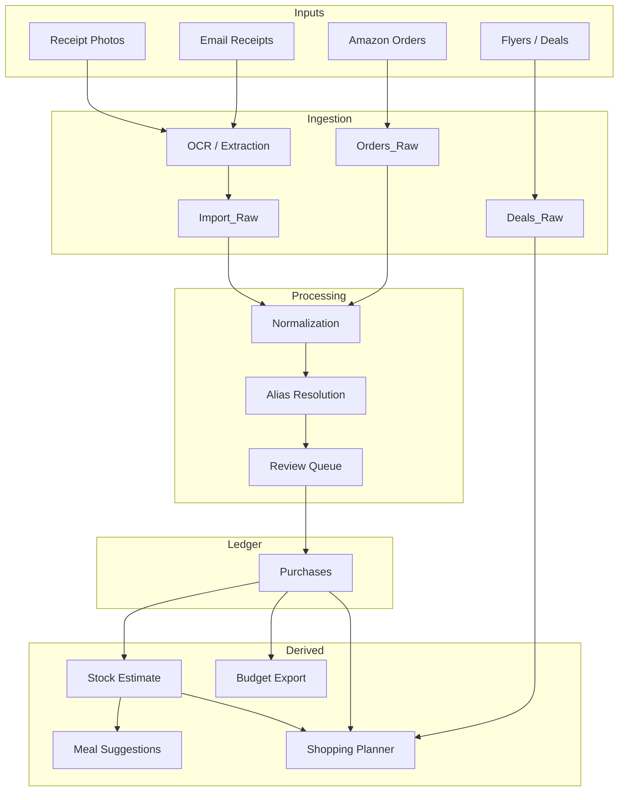
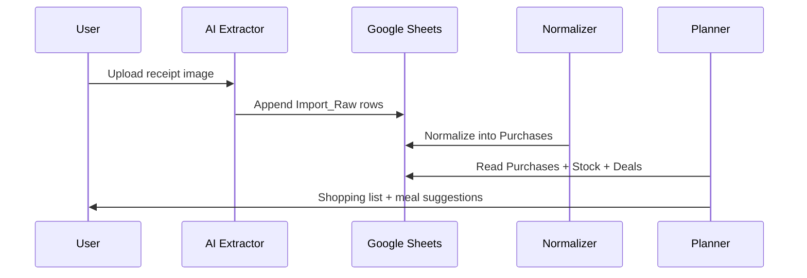

# Architecture

## Design philosophy

The system is intentionally conservative.

Receipts and order emails are treated as evidence of acquisition, not direct truth about current inventory.

The architecture therefore separates:

- raw evidence
- authoritative purchases
- derived inventory estimates
- recommendations and automations

This prevents OCR hallucinations or normalization mistakes from directly corrupting inventory state.

---

## High-level architecture

## Core tables

### Import_Raw

Append-only ingestion inbox.

Stores:

- raw receipt line
- OCR confidence
- source metadata
- timestamps
- ambiguity notes

No normalization occurs here.

### Purchases

Authoritative ledger.

Contains:

- canonical item names
- normalized quantities
- categories
- prices
- review state
- source references

### Stock

Derived estimate only.

Not directly mutated by OCR.

Recommended inventory states:

- none
- low
- available
- stocked
- unknown

### Deals_Raw

Captures:

- flyer deals
- web promotions
- email offers
- price history

### Budget_Export

Clean monthly/category rollups for external budgeting spreadsheets.

---

## AI responsibilities

### Good AI tasks

- OCR extraction
- alias matching
- category inference
- recipe suggestions
- shopping recommendations
- low-confidence review assistance
- deal matching

### Dangerous AI tasks

- exact inventory truth
- exact nutrition tracking
- destructive mutation
- silent normalization
- silent deduplication

The system should prefer uncertainty over false precision.

---

## Automation model

## Future evolution

### Phase 1

- Google Sheets
- Manual receipt uploads
- AI extraction
- AI normalization
- Shopping suggestions

### Phase 2

- Gmail ingestion
- Flyer/deal ingestion
- Amazon order imports
- Budget rollups
- Inventory decay logic

### Phase 3

- Supabase/Postgres backend
- APIs and web UI
- Barcode support
- Multi-user households
- Better recommendation models
- Local LLM orchestration
