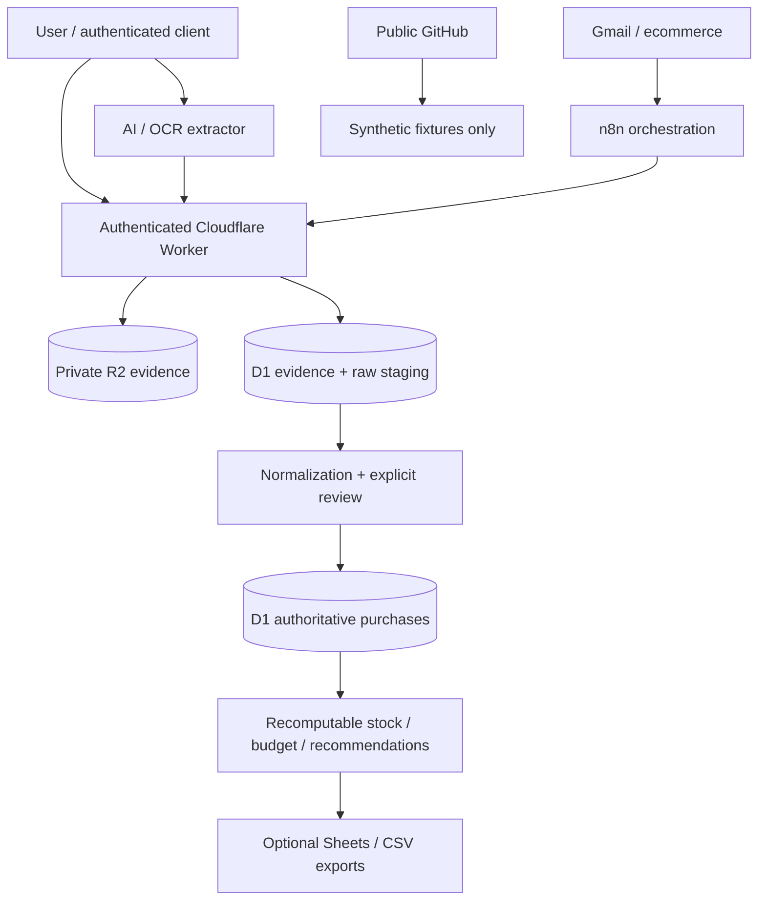
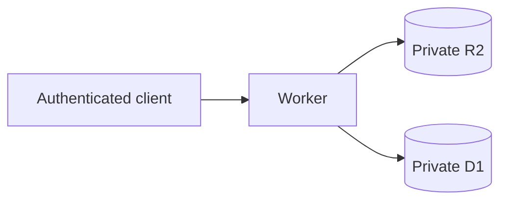
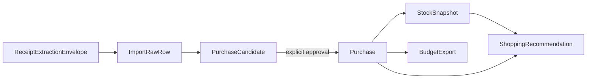

# Architecture

## Purpose and mental model

Shopping Inventory is a personal system for private receipt evidence, reviewed acquisition history, derived stock estimates, budget exports, and explainable shopping decisions.

The central invariant is:

> Evidence is not truth, authoritative purchases are reviewed facts, and stock/recommendations are derived views.

Receipts and order messages prove acquisition events. They do not prove present possession or consumption.

## Operating architecture

```mermaid
flowchart TD
  User[User / authenticated client]
  AI[AI / OCR extractor]
  Gmail[Gmail / ecommerce]
  N8N[n8n orchestration]
  Worker[Authenticated Cloudflare Worker]
  R2[(Private R2 evidence)]
  D1Raw[(D1 evidence + raw staging)]
  Review[Normalization + explicit review]
  D1Ledger[(D1 authoritative purchases)]
  Derived[Recomputable stock / budget / recommendations]
  Sheets[Optional Sheets / CSV exports]
  Git[Public GitHub]
  Fixtures[Synthetic fixtures only]

  User --> Worker
  User --> AI
  AI --> Worker
  Gmail --> N8N
  N8N --> Worker

  Worker --> R2
  Worker --> D1Raw
  D1Raw --> Review
  Review --> D1Ledger
  D1Ledger --> Derived
  Derived --> Sheets

  Git --> Fixtures
```

### Authority boundaries

| Surface | Role | Authority |
| --- | --- | --- |
| R2 receipt evidence | Private source evidence | Immutable evidence, not inventory truth |
| D1 extraction/raw rows | Private staging and provenance | Evidence/workflow state |
| D1 purchase candidates | Reviewed proposed canonical interpretation | Not authoritative until approved |
| D1 purchases | Reviewed acquisition ledger | Authoritative acquisition facts |
| Stock snapshots | Derived from purchases + policy + time | Recomputable estimate |
| Budget exports | Derived from authoritative purchases | Recomputable reporting output |
| Shopping recommendations | Derived from authoritative/derived evidence | Advisory only |
| Google Sheets / CSV | Optional review/export surface | Never authoritative for project state |
| Public GitHub | Code, schemas, migrations, docs, synthetic tests | Never personal-data storage |

## Privacy and trust boundaries

The repository is public. Real receipt, order, purchase, stock, budget, and household data must never become Git objects, PR content, issues, logs, or public fixtures.

The supported private data path is:

```mermaid
flowchart LR
  Client[Authenticated client] --> Worker[Worker]
  Worker --> R2[(Private R2)]
  Worker --> D1[(Private D1)]
```

The Worker is the supported application/API boundary. D1 and R2 are not direct client interfaces.

Repository-side controls are defense in depth:

- `AGENTS.md` establishes the pre-write rule for agents and automations;
- `npm run privacy:check` scans the complete tracked tree;
- CI runs the privacy gate on every PR and push to `main`;
- tracked files that cannot be safely inspected fail closed;
- public fixtures must be materially synthetic.

## Canonical domain flow

```mermaid
flowchart LR
  E[ReceiptExtractionEnvelope]
  R[ImportRawRow]
  C[PurchaseCandidate]
  P[Purchase]
  S[StockSnapshot]
  B[BudgetExport]
  Rec[ShoppingRecommendation]

  E --> R
  R --> C
  C -->|explicit approval| P
  P --> S
  P --> B
  S --> Rec
  P --> Rec
```

Only inventory `item` evidence may promote into a v1 purchase candidate. Ambiguous evidence remains review-only. Fees, deposits, tax, totals, informational lines, returns/refunds, and voids do not silently become acquisitions.

Authoritative purchases are immutable in place. Corrections create superseding records.

## Persistence model

Cloudflare D1 is the preferred private structured datastore. The repository maintains SQLite-compatible semantics where practical for local verification, portability, and recovery.

Cloudflare R2 holds receipt images and large source payloads under opaque keys.

Current relational layers include:

- `receipt_evidence`;
- `receipt_extraction_envelopes`;
- `import_raw_rows`;
- `purchase_candidates`;
- `purchases`;
- `audit_events`.

Derived stock, budget, and recommendation records are currently executable domain outputs rather than required persisted state.

## Automation model

n8n is an orchestration boundary, not a source of truth. Integrations may discover evidence and call the private Worker, but they must not write directly to authoritative purchases or derived inventory.

AI may assist with extraction, normalization suggestions, review, and recommendations. AI output is untrusted until it passes schema validation and the relevant review/authority boundary.

## Current maturity

The repository has proven the architecture with synthetic data:

- privacy publication controls;
- executable canonical contracts;
- private structured staging;
- D1/SQLite authoritative purchase invariants;
- a deterministic synthetic vertical slice through stock, budget, and recommendation outputs.

Production/private Cloudflare provisioning, durable review-event semantics, cross-ingestion duplicate policy, broader evaluation coverage, and remaining validation hardening are still active work.

## Evolution guardrails

Future work should follow demonstrated workflow friction rather than generic product completeness.

- Preserve the public-code/private-data boundary.
- Keep provider-specific details behind domain contracts.
- Prefer recomputable derived state over mutable secondary truth.
- Do not add a second authoritative datastore.
- Treat Sheets as optional export/review UX, not a fallback database.
- Add multi-user, retailer-specific, nutrition, deal, or autonomous behavior only when its trust and privacy boundaries are explicit.
