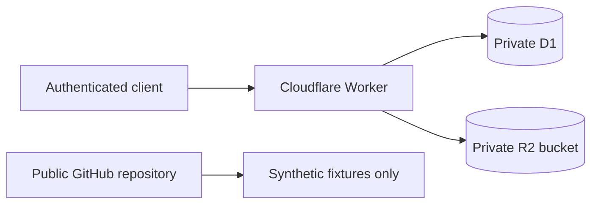

# Cloudflare private storage

Cloudflare D1 and R2 are the preferred private operating substrate for real household data.

The public repository contains code, migrations, documentation, and synthetic fixtures only. Real receipts, OCR payloads, purchase records, stock state, and exports must not be committed.

## Boundaries

- D1 stores structured records and references to evidence.
- R2 stores receipt images and large raw payloads.
- The Worker is the only supported access path.
- R2 buckets must not be public.
- Resource identifiers and credentials must not be committed.
- Google Sheets may receive exports, but is not authoritative state.
- CSV and SQLite-compatible exports provide portability and recovery.

## Environments

Use distinct local, development, and production resources. Local and CI execution use synthetic data and must not receive production credentials or contact production resources.

`wrangler.toml` intentionally contains a non-deployable D1 identifier placeholder. Keep deployable identifiers in private configuration and store `API_TOKEN` with Wrangler secrets.

## Initial API

- `GET /health`
- `POST /v1/receipts`
- `GET /v1/evidence/:evidenceId`

Every endpoint requires bearer authentication. Receipt objects use generated opaque identifiers without merchant, date, address, or household information. R2 retrieval is Worker-mediated and returns `private, no-store` responses.

## Operations still required before production

- provision isolated D1 and R2 resources;
- replace the placeholder through private deployment configuration;
- establish export and restore procedures;
- define evidence retention and deletion;
- add credential-rotation and disclosure-response runbooks;
- evaluate Cloudflare Access or scoped signed requests before multiple clients are supported.
