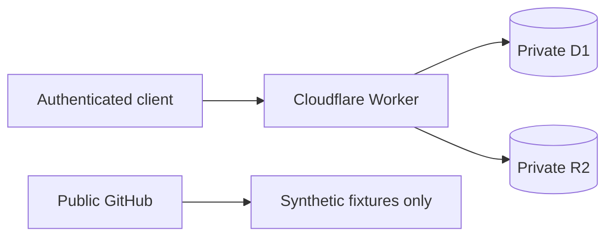

# Cloudflare private storage

Cloudflare D1 and R2 are the preferred private operating substrate. The public repository contains code, migrations, documentation, and materially synthetic fixtures only.

## Boundaries

- D1 owns structured private records and evidence references.
- R2 owns receipt images and large source payloads.
- The Worker is the supported application access boundary.
- Google Sheets is an optional export/review surface, not authoritative storage.
- Local and CI use synthetic data and do not require production credentials.
- `wrangler.toml` remains intentionally non-deployable without private configuration.

## Private API

- `GET /health`
- `POST /v1/receipts` — store receipt evidence in R2 plus D1 evidence metadata
- `GET /v1/evidence/:evidenceId` — retrieve evidence through the Worker
- `POST /v1/receipt-extractions` — validate and stage a canonical extraction envelope plus raw rows

Every endpoint requires bearer authentication. Evidence object keys and API responses use opaque identifiers.

## Structured extraction staging

`POST /v1/receipt-extractions` is a raw/staging boundary only:

1. accept `application/json` up to 1 MiB, with a defensive maximum of 500 lines;
2. validate canonical v1 fields, RFC3339 timestamps, identifiers, and line uniqueness;
3. preserve the immutable envelope as canonical JSON;
4. generate opaque IDs for flattened raw rows;
5. validate an optional evidence reference;
6. pass the generated rows as one bounded JSON array and expand them with D1 `json_each()`;
7. write the envelope, all raw rows, and minimal audit metadata in one three-statement D1 `batch()` transaction;
8. verify the reported raw-row write count;
9. make identical retries idempotent and reject conflicting reuse of an envelope ID;
10. return only opaque envelope/import identifiers.

Using `json_each()` keeps D1 query count constant as receipt size grows instead of creating one database statement per line. The 500-line limit is therefore a defensive memory/input bound rather than a provider-query workaround.

The intake endpoint does **not** create authoritative purchases, stock, budget, or recommendation state. Promotion remains a separate review/domain boundary.

Audit/logging metadata excludes raw payload contents. Request JSON is canonicalized before hashing so insignificant object-key order or whitespace does not change idempotency identity.

## Validation

Public CI:

- applies D1 migrations against Wrangler local D1;
- runs canonical contract tests;
- runs Worker boundary/idempotency tests;
- runs the repository privacy gate without production credentials.

## Operations still required before production

- provision isolated D1 and R2 resources;
- inject deployable resource identifiers and secrets privately;
- establish export/restore and evidence retention/deletion procedures;
- document credential rotation and disclosure response;
- add production-appropriate rate/abuse controls;
- evaluate stronger scoped authorization before supporting multiple clients.
