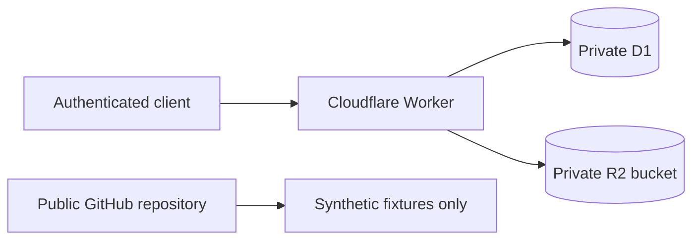

# Cloudflare private storage

Cloudflare D1 and R2 are the preferred private operating substrate for real household data.

The public repository contains code, migrations, documentation, and synthetic fixtures only. Real receipts, OCR payloads, purchase records, stock state, and exports must not be committed.

## Boundaries

- D1 stores structured records and references to evidence.
- R2 stores receipt images and large raw payloads.
- The Worker is the only supported access path.
- R2 buckets must not be public.
- Resource identifiers and credentials must not be committed.
- Google Sheets may receive exports, but is not authoritative state.
- CSV and SQLite-compatible exports provide portability and recovery.

## Environments

Use distinct local, development, and production resources. Local and CI execution use synthetic data and must not receive production credentials or contact production resources.

`wrangler.toml` intentionally contains a non-deployable D1 identifier placeholder. Keep deployable identifiers in private configuration and store `API_TOKEN` with Wrangler secrets.

## Private API

- `GET /health`
- `POST /v1/receipts` — store receipt image/PDF evidence in R2 plus D1 evidence metadata
- `GET /v1/evidence/:evidenceId` — retrieve private evidence through the Worker
- `POST /v1/receipt-extractions` — validate and stage one canonical `ReceiptExtractionEnvelope` plus generated `ImportRawRow` records in D1

Every endpoint requires bearer authentication. Worker authentication uses timing-safe comparison when the Workers Web Crypto extension is available.

Receipt objects use generated opaque identifiers without merchant, date, address, or household information. R2 retrieval is Worker-mediated and returns `private, no-store` responses.

### Structured extraction staging

`POST /v1/receipt-extractions` is deliberately a **raw/staging** boundary:

1. accept only `application/json` requests up to 1 MiB and at most 40 receipt lines;
2. validate the canonical v1 extraction-envelope fields, RFC3339 timestamps, identifiers, and line uniqueness;
3. preserve the immutable extraction envelope as canonical JSON in `receipt_extraction_envelopes`;
4. flatten every receipt line into a generated `ImportRawRow` staging record;
5. link to an existing private `receipt_evidence` record when `evidence_id` is supplied;
6. write envelope, raw rows, and payload-free audit metadata with one D1 `batch()` transaction;
7. treat repeated identical `envelope_id` + payload as idempotent;
8. reject reuse of an `envelope_id` for different content;
9. return only opaque envelope/import identifiers.

The 40-line bound leaves operational headroom under the current D1 Free-plan per-invocation query budget for the idempotency lookup, optional evidence lookup, transactional writes, and a bounded concurrent-retry recheck. If the provider limit changes, the bound and its regression test should be reviewed together.

This endpoint does **not** create `Purchase`, `Stock`, `BudgetExport`, or recommendation state. Promotion remains a separate review/domain boundary.

The request body is canonicalized before hashing so insignificant object-key order or whitespace does not change the idempotency identity. Audit metadata records only schema version, source type, and line count rather than merchant, basket, raw text, or prices.

## Migration validation

Public CI applies D1 migrations against Wrangler's local D1 environment using synthetic/no-production configuration. This catches invalid migration SQL without requiring production credentials or resource access.

## Operations still required before production

- provision isolated D1 and R2 resources;
- replace the placeholder through private deployment configuration;
- establish export and restore procedures;
- define evidence retention and deletion;
- add credential-rotation and disclosure-response runbooks;
- evaluate Cloudflare Access or scoped signed requests before multiple clients are supported;
- add production-appropriate abuse/rate controls before exposing the endpoint beyond a tightly controlled personal client.
