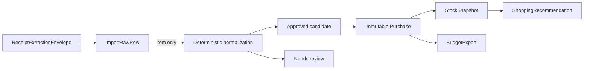

# Synthetic Vertical Slice v1

## Purpose

This slice is the executable acceptance path for the current privacy/schema milestone. It proves that the project's boundaries compose without using real household data, production Cloudflare resources, Gmail, Google Sheets, or AI inference.

## Synthetic scenario

The fixture is materially invented and totals **CAD 7.41**:

- CAD 4.00 confidently normalizable inventory item;
- CAD 3.00 ambiguous inventory item;
- CAD 0.10 deposit;
- CAD 0.31 tax.

The deterministic review fixture explicitly approves only the confident candidate.

Expected reconciliation:

| Bucket | Amount |
| --- | ---: |
| Authoritative purchase | 4.00 |
| Pending review | 3.00 |
| Non-inventory receipt adjustments | 0.41 |
| Accounted receipt total | 7.41 |

The total/subtotal evidence lines are reconciliation evidence only and are never treated as inventory-bearing state.

## Execution rules

`src/domain/vertical-slice.mjs` is deliberately pure for this acceptance path:

- all timestamps are supplied by the fixture;
- all IDs are deterministic opaque synthetic IDs;
- normalization uses an explicit synthetic catalog, not AI;
- review decisions are explicit input;
- only approved item candidates promote to purchases;
- candidate canonical item, quantity, unit, and amount are copied unchanged into the purchase;
- stock uses a documented exponential-decay heuristic at a fixed `as_of` time;
- budget output uses effective authoritative purchases only;
- recommendations consume Stock/Purchase evidence, never raw receipt text.

Running the same fixture twice must produce deeply equal output.

## Derived contracts

Derived outputs live in `schemas/v1/derived.schema.json`, separate from the stable acquisition bundle:

- `StockSnapshot`
- `BudgetExport`
- `ShoppingRecommendation`

This keeps the receipt→purchase contract stable while allowing derived operational contracts to evolve independently.

## Stock behavior

The synthetic approved item has a five-day half-life policy. At the fixed eight-day `as_of` time, the exponential estimate is approximately `0.3299` of the original unit and therefore maps to `low`.

This is an operational estimate, not a claim of exact possession. The snapshot records:

- state;
- estimated quantity;
- confidence;
- fixed derivation time;
- source purchase IDs;
- method and half-life inputs.

## Recommendation behavior

A `low` StockSnapshot produces one `buy` recommendation with medium urgency. The recommendation includes:

- a reason code;
- human-readable rationale;
- the source StockSnapshot ID;
- authoritative purchase IDs.

It intentionally omits merchant/raw receipt/ambiguous-line details.

## What this proves

CI proves:

- acquisition and derived records are schema-valid;
- all raw evidence retains provenance;
- deposit/tax/summary lines cannot become purchase candidates;
- the ambiguous item remains review-only;
- only the explicitly approved candidate becomes authoritative;
- promotion preserves canonical values;
- receipt reconciliation remains explainable while review is pending;
- Stock and Budget are recomputable from authoritative purchases;
- Recommendation consumes only authoritative/derived evidence;
- the complete result is deterministic.

## Non-goals

This is not production normalization or a production recommendation engine. It deliberately does not introduce:

- live AI extraction/normalization;
- production promotion endpoints;
- exact inventory truth;
- deals or flyers;
- nutrition/meal planning;
- multi-receipt duplicate/reprocessing semantics;
- persistent derived-state tables.

Those should build on this acceptance path rather than bypass it.
