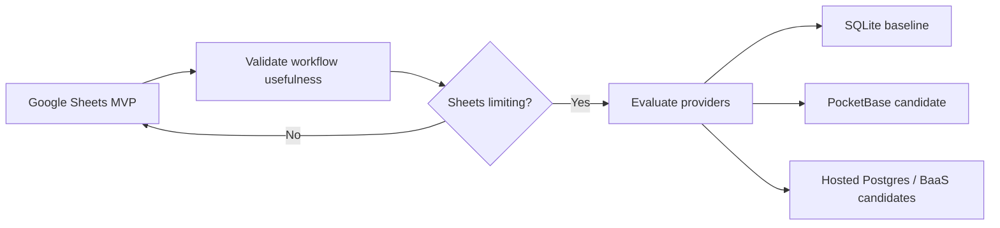

# Backend Provider Requirements and Evaluation

The project is spreadsheet-first for MVP. A backend provider should only be selected after the workflow proves useful and specific spreadsheet limitations appear.

This document defines provider-agnostic requirements and a lightweight evaluation matrix. It intentionally treats SQLite and PocketBase as current preferred candidates, not final decisions.

## Current posture

## Provider-agnostic requirements

### Data requirements

- append-only raw evidence support
- authoritative purchase ledger
- canonical item and alias tables
- derived stock estimates
- budget export rollups
- stable IDs across migration
- relational integrity or equivalent validation
- schema migration/versioning story
- bulk import/export from Google Sheets
- test fixture support

### Privacy and security requirements

- least-privilege automation access
- clear backup and restore story
- explicit handling of source evidence and attachments
- support for excluding restricted categories from shared/reported outputs
- auditable writes from automations
- credential isolation for workflows
- ability to run locally or self-host if desired
- no unnecessary lock-in for sensitive household data

### Automation requirements

- readable/writable from scripts
- compatible with n8n or simple HTTP/CLI workflows
- idempotent writes
- scheduled ingestion support directly or via external workflow
- easy export back to Sheets
- good failure/debug story

### Developer requirements

- simple local development
- good TypeScript and/or Python ergonomics
- migration tooling
- fixture-based testing
- CI-friendly
- inspectable data
- reasonable documentation
- low maintenance burden

### Product requirements

- usable by one person first
- does not require building a full app immediately
- can support future API/UI if useful
- can support receipt attachments eventually
- can support shared-household visibility later
- cheap enough for personal use

## Candidate classes

| Candidate | Strengths | Risks | Current stance |
| --- | --- | --- | --- |
| Google Sheets | reviewable, low-code, easy correction, already useful | weak constraints, concurrency limits, brittle automation at scale | MVP datastore |
| SQLite | portable, local-first, testable, simple backups, strong relational model | no built-in auth/API/admin UI | preferred baseline if Sheets limits appear |
| PocketBase | SQLite-backed, API, auth, admin UI, file handling, self-hostable | smaller ecosystem, custom migration/model patterns, auth rules still need care | leading lightweight backend candidate |
| DuckDB | excellent analytics, local-first, good for reporting | less suitable as transactional app store | possible analytics companion |
| Hosted Postgres | strong SQL, constraints, migrations, app backend path | ops/cost/network/auth complexity | evaluate later if hosted access matters |
| Supabase | hosted Postgres plus auth/storage/API/RLS | can be overkill, RLS/auth complexity, provider coupling | candidate, not default |
| Neon/Railway/Crunchy Postgres | managed Postgres options | app/API/auth must be added separately | candidate if Postgres wanted |
| Firebase | app-centric, auth/realtime, managed | document model less natural for ledger/audit use | lower fit unless app-first need emerges |
| Appwrite | BaaS features, self-host option | more platform commitment | candidate if app-first features dominate |
| Custom backend | maximum control | highest maintenance burden | defer |

## SQLite evaluation

SQLite fits if the next step is a local/testable data core.

Best for:

- normalization pipeline tests
- receipt/order fixtures
- canonical alias tables
- purchase ledger constraints
- stock recomputation
- budget export generation
- local CLI tools
- easy backups

Watch-outs:

- no built-in user model
- no admin UI unless added
- file attachment handling must be designed
- remote/mobile access needs another layer

## PocketBase evaluation

PocketBase fits if the next step needs a lightweight backend surface without abandoning SQLite.

Best for:

- API access
- admin UI for canonical items and aliases
- auth if a UI appears
- receipt image/file attachments
- small self-hosted deployment
- local-first-ish personal backend

Watch-outs:

- provider-specific collection/rule model
- migrations and versioning need discipline
- auth/visibility rules must be tested
- not as general-purpose as a hand-rolled backend

## Hosted Postgres evaluation

Hosted Postgres platforms fit if the project becomes a hosted multi-user app or analytics-heavy system.

Best for:

- SQL analytics
- multi-user hosted access
- mature migrations
- integrations with app backends
- stronger relational constraints at scale

Watch-outs:

- operational and cost overhead
- network dependency
- auth/RLS complexity if using Supabase-style platforms
- too much infrastructure before workflow validation

## Suggested evaluation criteria

Score candidates from 1-5.

| Criterion | Weight | Notes |
| --- | --- | --- |
| Local development simplicity | 5 | Can this be developed/tested without ceremony? |
| Data portability | 5 | Can data move in/out cleanly? |
| Relational integrity | 5 | Can ledger/alias constraints be enforced? |
| Automation compatibility | 4 | Can n8n/scripts read/write safely? |
| Backup/restore simplicity | 4 | Can personal data be protected and restored? |
| File attachment support | 3 | Useful for receipt images later |
| API/UI readiness | 3 | Useful only once an app surface exists |
| Auth/visibility model | 3 | Important later, not first MVP |
| Operational burden | 5 | Lower is better |
| Cost | 4 | Should stay cheap for personal use |
| Migration complexity | 4 | Can Sheets migrate cleanly? |
| Lock-in risk | 4 | Avoid premature provider coupling |

## Current recommendation

1. Keep Google Sheets as the MVP datastore and review surface
2. Define schemas, fixtures, and evaluation corpus first
3. If code is needed, implement against SQLite-compatible schemas first
4. If an API/admin UI/file surface becomes useful, evaluate PocketBase as the first backend candidate
5. Evaluate hosted Postgres/Supabase only after hosted multi-user or managed-cloud requirements are real

## Research questions

- Is the first executable artifact a CLI, Apps Script, PocketBase app, or n8n workflow?
- Should receipt images be retained, linked, or discarded after extraction?
- How much of Google Sheets remains as review UI if a backend is introduced?
- What data needs member/household visibility boundaries?
- Does the normalization pipeline need online access, or can it be local/offline?
- How important is mobile access versus desktop/local automation?

## Decision rule

Pick the smallest provider that satisfies proven workflow needs. Do not select infrastructure to satisfy speculative future features.
