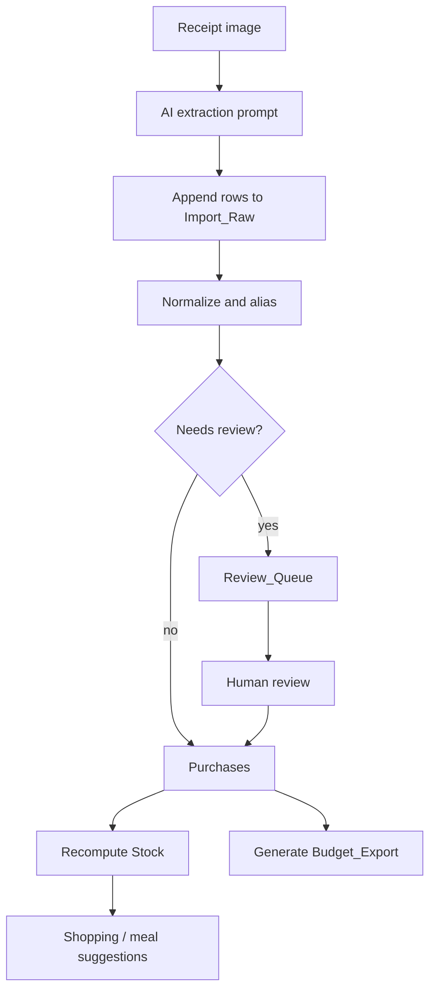

# Manual Receipt Ingestion Runbook

This runbook describes the first usable MVP workflow: process one receipt into raw imports, reviewed purchases, derived stock, and budget/shopping outputs.

## Preconditions

- Google Sheet exists with the canonical tabs
- Receipt image or OCR text is available
- Receipt ingestion prompt contract is available
- User can edit/review sheet rows

Canonical tabs:

- `Import_Raw`
- `Review_Queue`
- `Purchases`
- `Aliases`
- `Stock`
- `Budget_Export`

## Workflow overview

## Step 1: Capture receipt evidence

Use a clear receipt photo or pasted OCR text.

Do not crop out useful context such as:

- merchant
- date/time
- line items
- totals
- discounts
- tax markers

Avoid storing unnecessary source images long-term unless needed for review/debugging.

## Step 2: Run receipt extraction prompt

Use `docs/specs/receipt-ingestion-prompt-contracts.md`.

Extraction rules:

- preserve raw line text
- use `null` for unknown values
- do not invent quantities or prices
- keep ambiguous rows
- provide confidence and notes
- return structured JSON only

## Step 3: Append to `Import_Raw`

Each extracted receipt line becomes one `Import_Raw` row.

Generated fields:

| Field | Value |
| --- | --- |
| `import_id` | generated UUID or deterministic line ID |
| `receipt_id` | shared ID for receipt lines |
| `source_type` | `receipt_photo` |
| `extractor` | model/tool/workflow used |
| `extracted_at` | current timestamp |
| `review_state` | `new` |

Preserve raw evidence. Do not overwrite the raw OCR fields to make them look cleaner.

## Step 4: Normalize candidate rows

For each `Import_Raw` row:

1. match against `Aliases`
2. infer or confirm canonical item
3. map category
4. normalize quantity/unit when obvious
5. compute confidence
6. decide whether review is required

Use `docs/specs/normalization-pipeline.md` and `docs/specs/aliasing-canonicalization.md`.

## Step 5: Route uncertain rows to `Review_Queue`

Create a review task when:

- confidence is low
- duplicate risk exists
- alias is ambiguous
- quantity/price is unclear
- category is uncertain
- source data looks inconsistent

Review tasks should include the raw item text, suggested canonical item, confidence, and reason code.

## Step 6: Promote reviewed rows to `Purchases`

A row can become authoritative when:

- source row is traceable
- canonical item is known or explicitly accepted
- category is known
- duplicate risk is resolved
- review state is accepted or automation threshold is satisfied

`Purchases` should retain source references and raw item text for auditability.

## Step 7: Update aliases when useful

If a reviewed row reveals a reusable mapping, add or update an `Aliases` row.

Examples:

| Raw text | Canonical item |
| --- | --- |
| `BNNAS` | `bananas` |
| `2% MILK 4L` | `milk_2_percent` |
| `KITTY LITR` | `cat_litter` |

Do not create broad aliases that overmatch unrelated items.

## Step 8: Recompute `Stock`

`Stock` is derived from `Purchases`, decay rules, cadence, and optional manual overrides.

Do not directly mutate stock from receipt OCR.

Each stock row should include:

- estimated state
- confidence
- computed timestamp
- rationale

Use `docs/specs/inventory-decay-heuristics.md`.

## Step 9: Generate budget export

Use reviewed/promoted `Purchases` rows only.

Group by:

- budget period
- budget category
- optional merchant/category breakdown

Use `docs/specs/budget-export-mappings.md`.

## Step 10: Generate shopping or meal suggestions

Use:

- `Purchases`
- `Stock`
- `Deals_Raw` if available
- budget mappings
- preferences/manual notes

Every recommendation should explain why it was suggested.

Use `docs/specs/recommendation-engine.md`.

## Error handling

| Problem | Action |
| --- | --- |
| unreadable receipt | retry image/OCR or mark extraction failed |
| unknown item | route to review |
| likely duplicate | route to review |
| missing price | allow review; do not invent price |
| missing quantity | allow unknown quantity |
| category uncertainty | route to review or use misc category with note |
| inconsistent totals | review receipt-level extraction |

## Done criteria

A receipt is fully processed when:

- raw lines exist in `Import_Raw`
- uncertain rows are in `Review_Queue`
- accepted rows are in `Purchases`
- reusable aliases are captured
- stock estimates are recomputed
- budget export can be regenerated
- recommendations, if generated, include rationale
