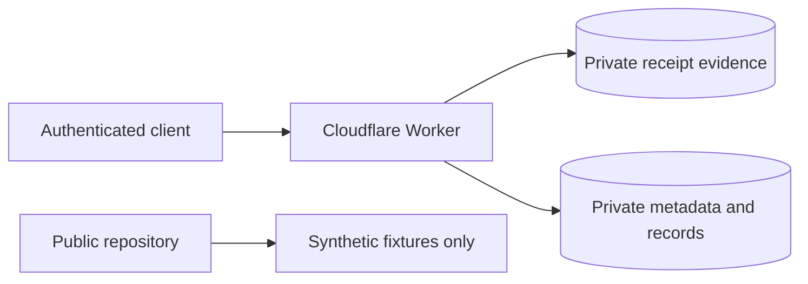

# Private Receipt Storage Runbook

This runbook applies whenever a receipt or order contains real household data.

See [Private Data Policy](../security/private-data-policy.md) and [Cloudflare private storage](../architecture/cloudflare-private-storage.md).

## Required boundary

Real receipt images, extraction payloads, purchase records, and derived household data must not be written to the public repository.

## Ingestion

1. Upload the source evidence through the authenticated Worker endpoint.
2. Store the image or PDF in private R2 using an opaque object key.
3. Store only the object reference and structured metadata in private D1.
4. Perform extraction and review against private records.
5. Create a new synthetic fixture when a parsing case should become a public regression test.
6. Delete or retain the source evidence according to the documented retention need.

## Local fallback

When Cloudflare resources are unavailable:

- store real evidence only under an ignored private path such as `.private/` or `receipts/private/`;
- encrypt retained local data at rest;
- do not stage or commit the files;
- do not copy the real payload into a public issue or pull request;
- migrate the data to approved private storage before deleting the local copy.

## Public regression fixtures

To preserve a useful parsing case:

- invent the merchant, identifiers, date, basket, prices, and totals;
- retain only the structural ambiguity required by the test;
- label the fixture as synthetic;
- verify that the original transaction cannot be reconstructed.

## Failure handling

| Failure | Required action |
| --- | --- |
| R2 write fails | Do not create authoritative metadata |
| D1 metadata write fails after R2 upload | Delete the newly written R2 object |
| Authentication fails | Reject without reading or storing the body |
| Unsupported or oversized content | Reject before durable storage |
| Private data is committed | Follow the incident process in the private-data policy |

## Completion criteria

- evidence is stored only in private R2 or an approved encrypted fallback;
- structured records exist only in private D1;
- no real payload appears in Git, CI logs, issues, or pull requests;
- any public fixture derived from the case is synthetic;
- retention and deletion decisions are recorded.
