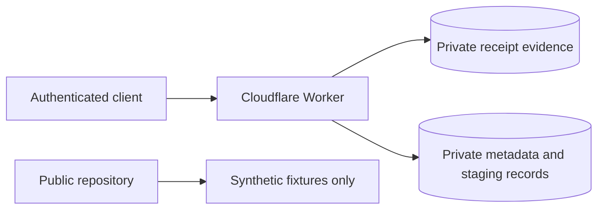

# Private Receipt Storage Runbook

This runbook applies whenever a receipt or order contains real household data.

See [Private Data Policy](../security/private-data-policy.md) and [Cloudflare private storage](../architecture/cloudflare-private-storage.md).

## Required boundary

Real receipt images, extraction payloads, purchase records, and derived household data must not be written to the public repository.

## Receipt-photo ingestion

1. Upload the source evidence to `POST /v1/receipts` through the authenticated Worker.
2. The Worker stores the image/PDF in private R2 using opaque generated identifiers.
3. The Worker stores only the private object reference and evidence metadata in D1.
4. Retain the returned `evidenceId` privately for the extraction step.

## Structured extraction ingestion

After extracting a receipt privately:

1. Construct a canonical v1 `ReceiptExtractionEnvelope`.
2. Use the opaque `evidenceId` in `source.evidence_id` when the extraction came from previously uploaded Worker evidence.
3. Send the envelope as `application/json` to `POST /v1/receipt-extractions`.
4. The Worker validates the bounded request and canonical envelope fields before storage.
5. The Worker stores the immutable envelope plus generated `ImportRawRow` staging rows in D1 using one atomic D1 batch.
6. The response returns only opaque `envelopeId` and `importId`/`lineId` mappings.
7. Re-sending the same envelope ID with equivalent canonical JSON is idempotent; reusing the ID for different content is rejected.
8. Continue normalization/review from private staging records. Do not promote directly from the intake request to authoritative purchases.

The structured intake endpoint never writes `Purchase`, `Stock`, budget, or recommendation state.

## Local fallback

When Cloudflare resources are unavailable:

- store real evidence/extraction payloads only under an ignored private path such as `.private/` or `receipts/private/`;
- encrypt retained local data at rest;
- do not stage or commit the files;
- do not copy the real payload into a public issue or pull request;
- do not substitute a Git branch/PR for the unavailable private endpoint;
- migrate the data to approved private storage before deleting the local copy.

## Public regression fixtures

To preserve a useful parsing case:

- invent the merchant, identifiers, date, basket, prices, and totals;
- retain only the structural ambiguity required by the test;
- label the fixture as synthetic;
- verify that the original transaction cannot be reconstructed.

## Failure handling

| Failure | Required action |
| --- | --- |
| R2 write fails | Do not create evidence metadata |
| D1 evidence metadata write fails after R2 upload | Delete the newly written R2 object |
| Structured JSON is invalid or unsupported | Reject before D1 staging writes |
| Referenced evidence does not exist | Reject the extraction; do not create staging rows |
| D1 staged batch fails | Treat envelope/raw/audit write as failed; do not partially promote state |
| Same envelope ID + same canonical payload | Return the existing opaque staging identifiers |
| Same envelope ID + different canonical payload | Reject with an idempotency conflict; create a new envelope ID for a new extraction attempt |
| Authentication fails | Reject without processing the private operation |
| Unsupported or oversized content | Reject before durable storage |
| Private data is committed | Follow the incident process in the private-data policy |

## Logging and audit boundary

Operational logs and `audit_events.metadata_json` must not include merchant names, raw line text, baskets, prices, email bodies, addresses, payment identifiers, or the extraction payload. Record only the minimum control metadata needed to understand the operation, such as schema version, source type, line count, opaque target ID, and outcome.

## Completion criteria

- evidence is stored only in private R2 or an approved encrypted fallback;
- extraction envelopes and raw staging rows exist only in private D1;
- the intake path cannot create authoritative or derived state;
- no real payload appears in Git, CI logs, issues, or pull requests;
- any public fixture derived from the case is materially synthetic;
- retention and deletion decisions are recorded.
