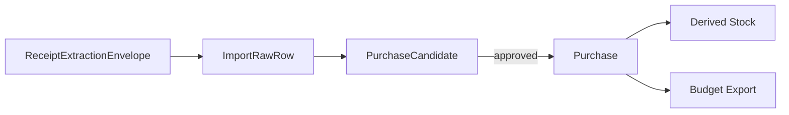

# Canonical Contracts v1

## Mental model

Each stage owns a different kind of truth. A nested extraction payload is not a purchase, and a purchase is not mutable raw evidence.

## Contract ownership

| Contract | Owner | Mutable fields | Purpose |
| --- | --- | --- | --- |
| `ReceiptExtractionEnvelope` | extractor | none after persistence | Preserve one extraction attempt and receipt-level context |
| `ImportRawRow` | ingestion pipeline | workflow review metadata only | Flatten line evidence for review and replay |
| `PurchaseCandidate` | normalization pipeline | review decision and explicit overrides | Propose a canonical interpretation |
| `Purchase` | reviewer/domain service | never updated in place; supersede instead | Authoritative acquisition ledger |
| `Stock` / `BudgetExport` | derived processors | fully recomputable | Operational views, never source truth |

## Required invariants

- Every record carries `schema_version` and `record_kind`.
- Stable IDs are opaque and must not embed merchant, location, timestamp, or household information.
- Every downstream record traces to the immediately preceding record.
- Raw text is preserved only in extraction and raw-import contracts.
- Suggested or canonical item values never appear in raw evidence contracts.
- Only `item` lines may create inventory-bearing candidates.
- Fees, deposits, discounts, coupons, taxes, totals, informational lines, returns, refunds, and voids cannot increase stock.
- Missing purchase dates remain `null`; they are not guessed into authoritative timestamps.
- Real instances live only in private D1/R2. Public fixtures are materially synthetic.

## Line classifications

| `line_type` | Financial meaning | Inventory effect |
| --- | --- | --- |
| `item` | acquired product amount | may create a candidate |
| `fee` | non-refundable service or handling fee | none |
| `deposit` | refundable container or similar deposit | none |
| `discount` | negative price adjustment | none |
| `coupon` | explicit promotional adjustment | none |
| `subtotal` | receipt summary | none |
| `tax` | tax summary | none |
| `total` | final receipt total | none |
| `informational` | loyalty/savings/message line | none |
| `return` | returned item line | negative acquisition adjustment after review |
| `refund` | money returned without necessarily identifying stock movement | none unless linked to a reviewed return |
| `void` | cancelled line | none |

## Prices and weighted items

- `unit_price` is the price per declared unit.
- `extended_price` is the signed line amount after quantity multiplication and before receipt-level totals.
- Weighted items use numeric `quantity`, an explicit unit such as `kg` or `lb`, and optionally `unit_price`.
- Currency is defined at the envelope or transaction level and uses ISO 4217 codes.
- Receipt totals are reconciliation values; they do not become inventory records.

## Corrections and supersession

Raw evidence is never rewritten to correct extraction mistakes. A new extraction envelope or review event is appended.

Authoritative purchases are corrected by creating a replacement purchase with `supersedes_id` pointing to the prior purchase. Consumers select the latest non-superseded record. This preserves provenance and avoids silent history mutation.

## Review-state mutation

Evidence payload fields are immutable. Workflow metadata such as `review_state` may change, but implementations should record review events or audit entries. The row is therefore evidence-immutable, not globally append-only.

## Versioning

Schemas use semantic versions.

- Patch: clarifications or validator corrections that do not change accepted records.
- Minor: additive optional fields or enum values that old consumers may safely ignore.
- Major: required fields, changed meanings, removed fields, incompatible enum changes, or identifier changes.

Every breaking migration must include:

1. a new schema directory;
2. migration notes;
3. fixture migration or explicit legacy classification;
4. D1 migration impact;
5. compatibility tests.

## Publication rules

The schemas are public. Instances containing real transactions are private. Synthetic examples must invent all identifiers, merchants, dates, baskets, prices, and totals rather than redact real records.
