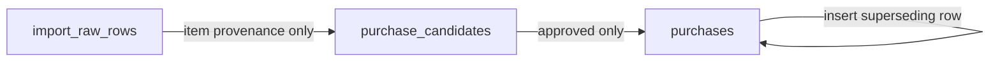

# D1 / SQLite Authoritative Schema v1

## Scope

This relational slice maps the canonical `PurchaseCandidate` and `Purchase` contracts into portable SQLite-compatible tables after private extraction/raw staging.

It intentionally does **not** persist derived `Stock`, `BudgetExport`, or recommendation state.

## Mental model

Application code should not be the only thing preventing an invalid promotion. The database records enough relational guard metadata to prove the important provenance facts and preserves authoritative purchase history:

- a candidate's source row is actually an `item`;
- a purchase's source candidate is actually `approved`;
- one candidate produces at most one authoritative purchase;
- authoritative purchases cannot be updated in place;
- one purchase has at most one direct superseding correction.

## `purchase_candidates`

Canonical fields:

- `candidate_id`
- `source_import_id`
- `canonical_item_id`
- `quantity`
- `unit`
- `amount`
- `normalization_confidence`
- `review_state`
- `created_at`

Relational guard field:

- `source_line_type` is fixed to `item` and participates in a composite foreign key to `import_raw_rows(import_id, line_type)`.

This extra column is persistence enforcement metadata, not a new canonical-domain property. Because the child value must be `item`, the foreign key can resolve only when the actual source raw row is also classified as `item`.

Before a candidate is promoted, its review state may move among `needs_review`, `approved`, and `rejected` according to the domain workflow.

## `purchases`

Canonical fields:

- `purchase_id`
- `source_candidate_id`
- `canonical_item_id`
- `quantity`
- `unit`
- `amount`
- nullable `acquired_at`
- nullable `supersedes_id`
- `created_at`

Relational guard field:

- `source_review_state` is fixed to `approved` and participates in a composite foreign key to `purchase_candidates(candidate_id, review_state)`.

This proves that an authoritative purchase can reference only an actually approved candidate. Once a purchase references that composite key, `ON UPDATE RESTRICT` also prevents silently rewriting the historical candidate approval behind the purchase.

A `BEFORE UPDATE` trigger rejects every in-place modification to `purchases`. This enforces the canonical rule that a purchase is an immutable acquisition fact: corrections must insert a new purchase that points to the prior row with `supersedes_id`. It also prevents retroactively editing supersession links to create cycles.

## Idempotency and correction invariants

- `purchases.source_candidate_id` is unique, so retrying promotion cannot create two authoritative purchases for one candidate.
- `purchases.supersedes_id` is unique, so a prior purchase cannot have two competing direct corrections.
- `supersedes_id` cannot equal `purchase_id`.
- supersession is a self-referencing foreign key; corrections create a new immutable purchase rather than mutating the old purchase in place.
- a correction may itself be superseded, producing a linear chain.

The database prevents direct correction forks and in-place cycle creation, but selecting the effective latest purchase remains a domain/query concern.

## Numeric constraints

- quantities must be positive;
- normalization confidence is nullable or within `[0, 1]`;
- monetary amounts are nullable and constrained to cent precision to match the canonical JSON Schema money contract.

## Lifecycle behavior

The migration intentionally does **not** prohibit deletion. Privacy retention/deletion requirements remain under #18, so hard-coded no-delete policy would prematurely conflict with operational requirements.

Because supersession uses `ON DELETE RESTRICT`, lifecycle cleanup of a correction chain must proceed child-first: remove the newest superseding row before its parent. The synthetic fixtures follow the same order.

## Deliberate non-goals

This migration does not attempt to enforce that every duplicated value on `Purchase` exactly equals the corresponding approved candidate value. Doing that with composite keys would significantly widen persistence-only metadata, especially around nullable fields, for limited safety benefit.

Promotion code and vertical-slice tests should assert canonical value copying. The relational layer focuses on the higher-value provenance, approval, immutability, duplicate-promotion, and supersession boundaries.

## Validation

CI applies migrations to Wrangler local D1 and runs synthetic positive/negative SQL fixtures proving:

- valid item → approved candidate → purchase promotion succeeds;
- duplicate promotion remains a single purchase;
- one linear superseding correction succeeds;
- non-item raw evidence cannot become a candidate;
- an unapproved candidate cannot become a purchase;
- a second direct correction fork is rejected;
- a promoted candidate's historical approved state cannot be rewritten;
- an authoritative purchase cannot be updated in place.

No production resources or private household data are required for these checks.
