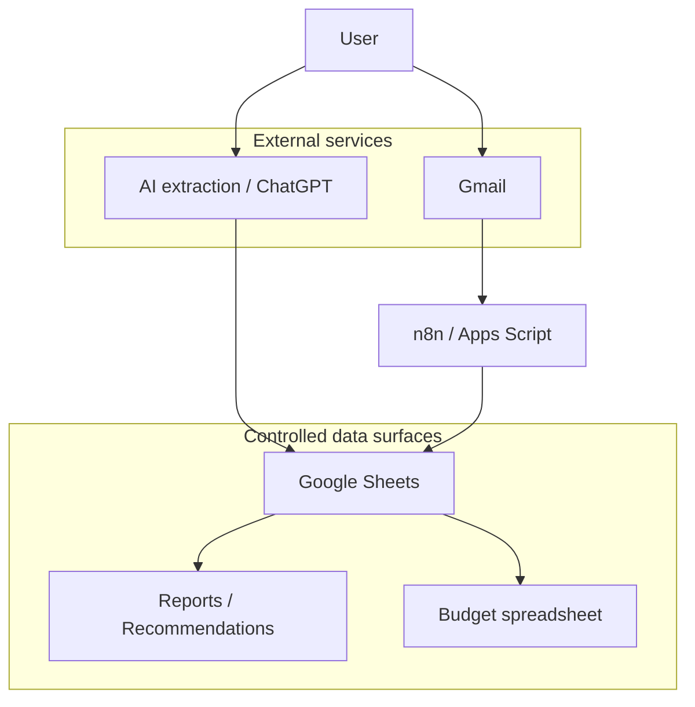

# Threat Model and Privacy Considerations

Shopping Inventory handles household purchase data. That data can look mundane, but it can reveal sensitive patterns about health, finances, habits, diet, pets, location, family composition, and routines.

## Scope

This threat model covers the spreadsheet-first MVP and near-term integrations:

- receipt photo ingestion
- OCR / AI extraction
- Google Sheets storage
- Gmail/order import
- deal/flyer import
- shopping/meal recommendations
- budget export
- future Apps Script or n8n automation

## Assets

| Asset | Sensitivity | Notes |
| --- | --- | --- |
| Receipt images | High | May contain card fragments, store locations, timestamps, pharmacy items |
| Raw OCR text | High | Preserves all source evidence, including sensitive lines |
| Email/order imports | High | May expose addresses, order IDs, full purchase history |
| Purchases ledger | High | Authoritative household consumption/spend history |
| Stock estimates | Medium | Derived but reveals habits and routines |
| Budget exports | High | Financial behavior and spending categories |
| Alias table | Medium | Can reveal household staples and sensitive product classes |
| Recommendations | Medium/High | Can expose inferred needs, health, diet, or household patterns |

## Trust boundaries

## Primary threats

### 1. Sensitive purchase inference

Purchase history can imply health conditions, financial stress, dietary choices, religious/cultural practices, household composition, or personal routines.

Mitigations:

- classify pharmacy/health-adjacent categories as sensitive
- avoid casual recommendations based on sensitive categories
- require explicit enablement for health/nutrition inference
- support category-level redaction from reports

### 2. Raw evidence leakage

Receipt images and email imports may contain more data than needed.

Mitigations:

- store source references only when needed
- avoid copying full email bodies into Sheets when line items suffice
- redact payment card fragments where possible
- avoid sharing raw tabs with household members by default

### 3. AI hallucination or silent mutation

AI can misread receipts, invent quantities, merge lines, or normalize incorrectly.

Mitigations:

- raw imports are append-only evidence
- AI output is not authoritative
- low-confidence rows go to review
- derived stock is recomputable
- every recommendation includes rationale

### 4. Over-permissioned integrations

Gmail, Sheets, Apps Script, and n8n workflows can easily request broader permissions than necessary.

Mitigations:

- prefer least-privilege OAuth scopes
- isolate automation accounts where practical
- restrict workflows to receipt/order labels or search queries
- avoid blanket mailbox ingestion
- log automation writes

### 5. Household privacy conflicts

Shared households can have different visibility expectations.

Mitigations:

- add household/member scope before multi-user features
- default sensitive categories to private
- separate personal purchases from shared household staples
- avoid exposing raw evidence to all members

### 6. Budget data coupling

Budget exports may link purchase details to financial planning data.

Mitigations:

- export category rollups, not raw purchase lines, by default
- document mapping rules
- allow exclusion of sensitive categories
- retain source filters in export notes

### 7. Workflow compromise

n8n or Apps Script credentials could be abused to read/write sensitive data.

Mitigations:

- keep workflow credentials scoped
- avoid embedding secrets in repo or sheets
- rotate credentials if exposed
- prefer manual approval for destructive workflows
- keep audit columns on automated writes

## Privacy principles

- Minimize raw data copied into durable storage
- Separate raw evidence from authoritative ledgers
- Prefer coarse derived states over invasive precision
- Require review for sensitive or low-confidence inferences
- Make automated actions explainable and reversible
- Do not infer health, nutrition, or personal behavior beyond the explicit user goal

## Data retention guidance

| Data | Suggested retention |
| --- | --- |
| Receipt images | Short-lived unless needed for audit |
| Raw OCR rows | Retain while useful for replay/debugging |
| Purchases ledger | Long-lived authoritative history |
| Stock estimates | Regenerate; no long-term retention required |
| Recommendations | Short-lived reports unless explicitly archived |
| Budget exports | Retain according to budget workflow needs |

## Security checklist before Gmail/order ingestion

- [ ] Define Gmail search scope or label strategy
- [ ] Avoid reading unrelated emails
- [ ] Define what email fields are stored
- [ ] Redact unnecessary personal/order metadata
- [ ] Add review queue for uncertain imports
- [ ] Log workflow writes with extractor/workflow identity
- [ ] Document credential storage and rotation
- [ ] Confirm household visibility policy

## Safe defaults

- Manual receipt ingestion first
- Category rollups for budget exports
- Sensitive categories excluded from casual recommendations
- No autonomous purchasing
- No destructive edits to raw evidence
- No direct Stock mutation from OCR/AI output
