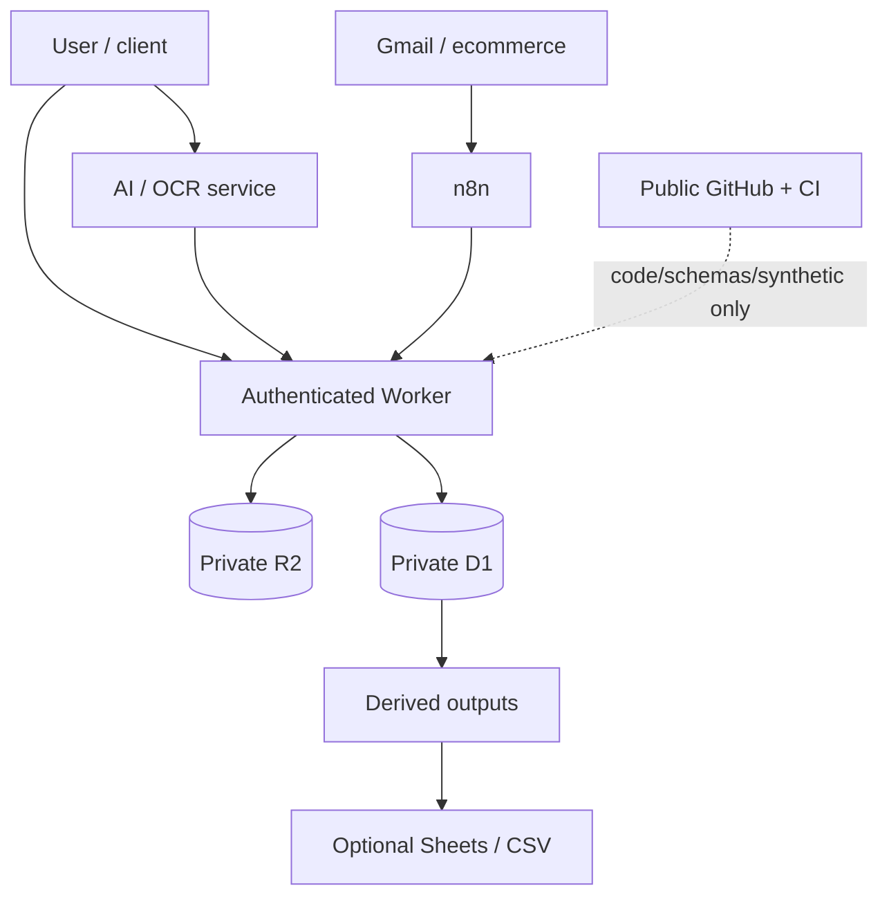

# Threat Model and Privacy Considerations

Shopping Inventory handles household purchase data. Receipt and purchase history can expose location, routines, spending, diet, health-adjacent purchases, pets, household composition, and other sensitive patterns.

## Scope

This threat model covers:

- receipt image/PDF ingestion;
- AI/OCR extraction;
- authenticated Worker APIs;
- Cloudflare D1 and R2;
- review and authoritative purchase promotion;
- n8n/Gmail/ecommerce integrations;
- derived stock, budget, and recommendation outputs;
- optional Google Sheets/CSV exports;
- the public GitHub repository and CI pipeline.

## Assets

| Asset | Sensitivity | Notes |
| --- | --- | --- |
| Receipt/order evidence | High | Can contain identifiers, store/time/location, pharmacy/payment data |
| Raw extraction payloads | High | Preserves source-derived private detail |
| Purchase ledger | High | Authoritative household acquisition/spend history |
| Review/audit history | High | Links people/automation to sensitive decisions |
| Stock estimates | Medium/High | Derived but reveals habits and household state |
| Budget exports | High | Financial behavior and spending categories |
| Recommendations | Medium/High | Can expose inferred needs and sensitive categories |
| Credentials/resource IDs | High | Can grant access to the private operating substrate |

## Trust boundaries

```mermaid
flowchart TD
  User[User / client]
  AI[AI / OCR service]
  Gmail[Gmail / ecommerce]
  N8N[n8n]
  Worker[Authenticated Worker]
  R2[(Private R2)]
  D1[(Private D1)]
  Derived[Derived outputs]
  Sheets[Optional Sheets / CSV]
  Git[Public GitHub + CI]

  User --> Worker
  User --> AI
  AI --> Worker
  Gmail --> N8N
  N8N --> Worker
  Worker --> R2
  Worker --> D1
  D1 --> Derived
  Derived --> Sheets

  Git -. code/schemas/synthetic only .-> Worker
```

Boundary rules:

- the public repository is never a data-ingestion destination;
- the Worker is the supported client boundary for private D1/R2;
- raw/AI output cannot directly mutate authoritative purchases or Stock;
- Sheets/CSV are optional exports, not authoritative storage;
- external integrations receive only the minimum private context needed for their task.

## Primary threats and controls

### 1. Public-data leakage through Git or CI

Failure mode: a user, agent, automation, or test places real receipt/order data into a branch, PR, issue, artifact, or log.

Controls:

- pre-write agent rule in `AGENTS.md`;
- complete tracked-tree privacy scanning on every PR/push;
- content-based receipt detection independent of path;
- fail-closed handling for unscannable tracked files;
- synthetic fixtures require explicit synthetic treatment;
- scanner diagnostics report path/policy class rather than matched payload.

Residual risk: Git history rewriting cannot retract already copied data from clones, caches, screenshots, or forks.

### 2. Unauthorized private-storage access

Failure mode: direct or unauthenticated access to receipt evidence or structured household data.

Controls:

- Worker authentication before request processing;
- private R2 access through the Worker;
- opaque evidence/object identifiers;
- no production credentials/resource IDs in public Git;
- private/no-store evidence responses;
- evaluate stronger scoped/short-lived client authorization before multi-client use.

### 3. AI hallucination or silent authority escalation

Failure mode: extraction/normalization invents fields or silently mutates authoritative state.

Controls:

- versioned schema validation;
- evidence/candidate/purchase contract separation;
- explicit review before promotion;
- item-only and approved-only D1 provenance constraints;
- immutable authoritative purchases corrected through supersession;
- derived state remains recomputable.

### 4. Duplicate/reprocessing corruption

Failure mode: retries or multiple evidence sources create duplicate authoritative purchases.

Current controls:

- same envelope ID + same canonical payload is idempotent;
- conflicting envelope reuse is rejected;
- one candidate cannot produce multiple purchases.

Remaining risk: distinct evidence records for the same real transaction require the conservative duplicate/review policy tracked by #13.

### 5. Review/audit repudiation

Failure mode: mutable review state changes without durable actor/reason evidence.

Current controls:

- immutable evidence and purchases;
- payload-minimal audit infrastructure.

Remaining work: #14 defines append-only approval/rejection/override/correction events and projection semantics.

### 6. Over-permissioned integrations

Failure mode: Gmail, n8n, or other external systems receive more access/data than required.

Controls:

- least-privilege OAuth/scopes;
- bounded searches/labels rather than whole-mailbox ingestion;
- credentials outside Git;
- orchestration cannot bypass canonical review/authority boundaries;
- private payloads must not be copied into logs or public artifacts.

### 7. Sensitive inference and derived-data leakage

Failure mode: recommendations, nutrition, budget, or household views reveal more than the user intended.

Controls:

- derived outputs use authoritative/derived evidence, not raw payloads directly;
- minimize fields on export;
- sensitive categories require explicit product policy before broad inference;
- no autonomous purchasing;
- derived state should be short-lived/recomputable where possible.

### 8. Lifecycle and recovery failure

Failure mode: private evidence cannot be deleted/restored, or backups/exports create unmanaged copies.

Controls and remaining work:

- opaque object references and versioned migrations already exist;
- #18 owns production retention/deletion, deterministic export/restore, credential rotation, and quota/cost operations.

## Privacy principles

- Minimize raw durable data.
- Separate evidence, proposed interpretation, authoritative facts, and derived views.
- Prefer uncertainty to false precision.
- Require explicit review at authority transitions.
- Keep automation explainable and reversible.
- Do not infer health/nutrition/behavior beyond the explicit product goal.
- Never use public Git as a queue, cache, backup, or temporary private-data store.

## Safe defaults

- authenticated private ingestion;
- synthetic repository/CI data only;
- ambiguous records remain review-only;
- no destructive evidence edits;
- no direct Stock mutation from OCR/AI;
- no autonomous purchasing;
- optional exports contain the minimum necessary private detail.
