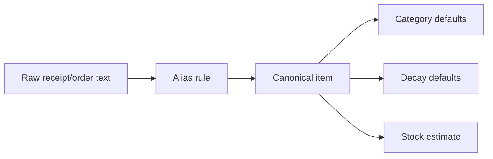

# Item Aliasing and Canonicalization Strategy

Receipt and order data is messy. The system needs stable canonical item identities without pretending that OCR and merchant abbreviations are clean.

## Mental model

Raw item text is evidence. A canonical item is the system's stable working identity for planning, stock estimation, and budget grouping.

## Canonical item identity

A canonical item should represent a stable household planning concept, not necessarily a SKU.

Good canonical items:

- `milk_2_percent`
- `eggs_large`
- `tofu_firm`
- `bananas`
- `cat_litter`
- `dish_soap`

Too specific for MVP:

- exact UPC-level variants
- exact package redesigns
- every brand-size combination

Too broad:

- `food`
- `produce`
- `household`

## Canonical item fields

Canonical items may initially live in `Aliases`, but should eventually become a separate reference table if the system grows.

Suggested canonical metadata:

| Field | Description |
| --- | --- |
| `canonical_item_id` | Stable snake-case identifier |
| `canonical_item_name` | Human-readable name |
| `category_primary` | Main inventory/budget category |
| `category_secondary` | Optional subcategory |
| `default_storage_area` | Pantry/fridge/freezer/household/unknown |
| `is_perishable` | Whether freshness decay matters |
| `default_decay_days` | Default stock/freshness window |
| `staple_status` | `staple`, `occasional`, `rare`, `unknown` |
| `household_member_scope` | Optional owner/scope for shared households |

## Alias matching order

Use deterministic matching before semantic matching.

1. Exact merchant-scoped alias
2. Exact global alias
3. Contains merchant-scoped alias
4. Contains global alias
5. Regex merchant-scoped alias
6. Regex global alias
7. Semantic candidate suggestion
8. New canonical item candidate

## Alias confidence

| Match type | Starting confidence |
| --- | --- |
| Reviewed exact alias | 0.99 |
| Reviewed contains alias | 0.90 |
| Reviewed regex alias | 0.85 |
| Merchant-scoped semantic suggestion | 0.70 |
| Global semantic suggestion | 0.60 |
| New item candidate | 0.40 |

Confidence should be adjusted down for low OCR confidence, ambiguous abbreviations, missing merchant context, or unusual price/quantity.

## Review rules

Require review when:

- semantic suggestion creates a new canonical item
- canonical match confidence is below threshold
- item has privacy-sensitive category implications
- multiple plausible aliases match
- quantity/unit changes category semantics
- item is likely a duplicate import

## Naming conventions

Canonical IDs should be stable, lowercase, and snake-case.

Examples:

| Raw text | Canonical ID | Canonical name |
| --- | --- | --- |
| `BNNAS` | `bananas` | Bananas |
| `ORG BANANA` | `bananas` | Bananas |
| `2% MILK 4L` | `milk_2_percent` | Milk, 2% |
| `FRM TOFU` | `tofu_firm` | Tofu, firm |
| `KITTY LITR` | `cat_litter` | Cat litter |

## Brand handling

Default MVP behavior:

- Ignore brand unless it changes planning semantics
- Preserve brand in notes/source text when available
- Add brand later only for staples where preference matters

Brand matters when:

- pet food or litter compatibility matters
- medication/pharmacy item identity matters
- allergy/diet preference depends on brand
- price comparison is only meaningful for same product class

## Quantity/package handling

Canonical item identity should usually not include quantity.

Prefer:

- canonical item: `rolled_oats`
- purchase quantity: `1 kg`

Avoid:

- canonical item: `rolled_oats_1kg_bag`

Exception: package size may become important for price history or stock estimation, but that belongs in purchase metadata first.

## Lifecycle

| State | Meaning |
| --- | --- |
| `active` | Approved for automatic use |
| `needs_review` | Candidate or uncertain alias |
| `deprecated` | Do not use for new normalization |

Deprecated aliases should be retained for auditability.

## Failure modes

- Over-merging distinct items into one canonical item
- Under-merging every receipt spelling into separate items
- Brand/size explosion too early
- AI silently creating canonical items without review
- Category mappings drifting into budget noise

The MVP should bias toward review and coarse grouping rather than false precision.
