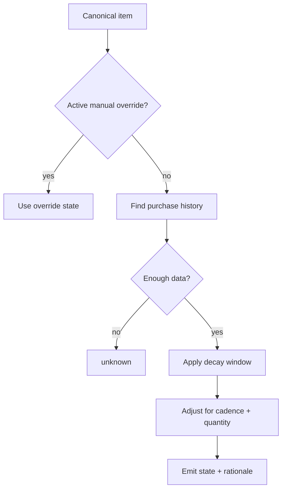

# Inventory Decay Heuristics

Inventory state is an estimate, not truth. The system should produce coarse, explainable stock states that are good enough for shopping and meal planning without pretending to know exact consumption.

## Goals

- Estimate likely stock state from purchase history
- Prefer coarse states over false precision
- Explain why an item is suggested or suppressed
- Support perishable and non-food household items
- Allow manual overrides

## Stock states

| State | Meaning |
| --- | --- |
| `none` | Likely unavailable or expired/consumed |
| `low` | Likely running low or should be checked |
| `available` | Likely available in usable quantity |
| `stocked` | Likely enough on hand; suppress replenishment |
| `unknown` | Insufficient data |

## Inputs

- purchase recency
- quantity/package size when known
- item perishability
- default decay window
- purchase cadence
- category heuristics
- manual overrides
- household/member scope
- storage area

## Category defaults

Initial defaults should be conservative and editable.

| Category | Storage | Default decay / stock window |
| --- | --- | --- |
| Fresh produce | fridge/pantry | 3-10 days |
| Leafy greens | fridge | 3-5 days |
| Dairy | fridge | 7-21 days |
| Eggs | fridge | 21-35 days |
| Meat/seafood fresh | fridge | 1-4 days |
| Frozen food | freezer | 60-180 days |
| Pantry dry goods | pantry | 60-365 days |
| Canned/jarred goods | pantry | 180-720 days |
| Snacks | pantry | 14-60 days |
| Beverages | fridge/pantry | 7-60 days |
| Cat food | household/pantry | cadence-based |
| Cat litter | household | cadence-based |
| Paper goods | household | cadence-based |
| Cleaning supplies | household | cadence-based |
| Toiletries | household | cadence-based |
| Pharmacy basics | household | review-sensitive |

## Basic state algorithm

For each canonical item:

1. Gather purchases within the evaluation window
2. Apply manual override if active
3. Estimate freshness/availability window
4. Compare days since last purchase to expected window
5. Adjust using purchase cadence and quantity
6. Return stock state, confidence, and rationale



## Heuristic v0

Suggested first-pass rule:

```text
age_days = today - last_purchased_at
window = item.default_decay_days or category.default_decay_days
ratio = age_days / window

if no purchase history:
  state = unknown
elif ratio < 0.35 and recent quantity is large:
  state = stocked
elif ratio < 0.75:
  state = available
elif ratio < 1.20:
  state = low
else:
  state = none
```

For non-perishable cadence-based items:

```text
expected_interval = median days between purchases
age_days = today - last_purchased_at
ratio = age_days / expected_interval

if insufficient cadence history:
  state = available or unknown depending on recency
elif ratio < 0.70:
  state = stocked
elif ratio < 1.10:
  state = available
elif ratio < 1.50:
  state = low
else:
  state = none
```

## Confidence scoring

Confidence increases with:

- repeated purchase history
- stable cadence
- known quantity
- reviewed canonical item
- non-perishable category

Confidence decreases with:

- unknown quantity
- perishable item
- irregular purchase cadence
- multiple household members
- ambiguous category
- likely shared/consumed quickly items

## Manual overrides

Manual overrides should be explicit and temporary when possible.

Examples:

- `milk_2_percent = none` because it was finished today
- `cat_litter = stocked` until next month
- `spinach = none` because it spoiled

Overrides should not edit purchase history.

## Recommendation rationale examples

- `Bananas likely low because last purchase was 6 days ago and produce decay window is 5 days`
- `Cat litter likely available because last purchase was 12 days ago and cadence is usually 28-35 days`
- `Frozen vegetables suppressed because multiple purchases occurred within the last 10 days`

## Failure modes

- Treating purchase as possession forever
- Over-recommending perishable items
- Suppressing staples because of stale large purchases
- Applying single-person consumption assumptions to shared households
- Using exact quantities when only coarse evidence exists

The system should be comfortable saying `unknown`.
