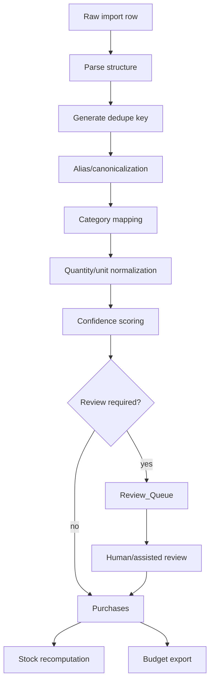

# Normalization Pipeline Specification

The normalization pipeline turns raw evidence into reviewed, authoritative purchase rows without allowing AI/OCR output to silently mutate inventory truth.

## Goals

- Preserve raw evidence unchanged
- Normalize messy receipt/order lines into canonical purchase records
- Route uncertain cases to review
- Produce deterministic enough outputs to test and replay
- Maintain provenance from purchase rows back to raw imports

## Non-goals

- Exact current inventory truth
- Exact nutrition tracking
- Fully autonomous destructive mutation
- Perfect receipt parsing across all merchants

## Pipeline stages

## Stage details

### 1. Parse structure

Input: one `Import_Raw` or `Orders_Raw` row.

Output candidate fields:

- item text
- quantity
- unit
- line price
- merchant
- purchase/order timestamp
- source metadata

Parsing should keep both raw and normalized values.

### 2. Generate dedupe key

The dedupe key should be deterministic and based on stable source evidence.

Suggested receipt dedupe input:

- merchant normalized
- purchase date
- receipt total when available
- raw line hash
- source image hash when available

Suggested order dedupe input:

- source system
- order id
- item text
- price
- ordered date

A possible duplicate should be routed to `Review_Queue`, not discarded automatically.

### 3. Alias/canonicalization

Alias resolution maps raw item text to a canonical item ID.

Resolution order:

1. exact active alias scoped to merchant
2. exact active global alias
3. contains/regex active alias scoped to merchant
4. contains/regex active global alias
5. semantic suggestion
6. new canonical item candidate

Semantic suggestions must not silently create authoritative aliases unless explicitly approved.

### 4. Category mapping

Categories come from, in priority order:

1. reviewed alias category
2. canonical item default category
3. merchant/source category hint
4. AI/category inference
5. manual review

Low-confidence or policy-sensitive categories should be reviewed.

### 5. Quantity/unit normalization

Normalize obvious package and unit patterns, but preserve raw quantity text.

Examples:

- `2 x 500g` -> `quantity_value=1000`, `quantity_unit=g`, `package_count=2`
- `1L` -> `quantity_value=1`, `quantity_unit=L`
- `EA` -> `quantity_unit=each`

Unknown quantities are acceptable. Do not invent precision.

### 6. Confidence scoring

Each promoted purchase row should carry `normalization_confidence`.

Suggested signals:

- OCR confidence
- parse confidence
- alias confidence
- category confidence
- quantity confidence
- duplicate risk
- price parse confidence

A conservative initial threshold:

| Condition | Action |
| --- | --- |
| confidence >= 0.90 and no risk flags | promote |
| confidence 0.70-0.89 | review unless alias is already approved |
| confidence < 0.70 | review |
| duplicate risk | review |
| policy-sensitive item | review |

## Promotion rules

A row may be promoted into `Purchases` when:

- source row is traceable
- canonical item is known or explicitly accepted
- category is known
- review state is `reviewed` or automation threshold is satisfied
- no unresolved duplicate risk remains

Promotion should be idempotent. Re-running the pipeline against the same raw row should not create duplicate purchase rows.

## Error handling

| Failure | Handling |
| --- | --- |
| Missing price | Allow promotion with note if item identity is useful |
| Missing quantity | Allow promotion with unknown quantity |
| Missing merchant | Allow but lower confidence |
| Ambiguous item | Review |
| Duplicate candidate | Review |
| Inconsistent receipt totals | Review |

## Auditability

Every purchase row should be explainable:

- where it came from
- which alias matched
- what confidence was assigned
- whether a human reviewed it
- what changed during review

## Implementation targets

This spec can be implemented by:

- manual ChatGPT + Google Sheets workflow
- Apps Script functions
- n8n workflow steps
- future CLI/backend service

The rules should remain portable across implementations.
