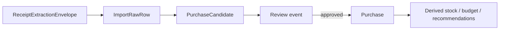

# Normalization Pipeline Specification

The normalization pipeline turns private raw evidence into reviewed, authoritative acquisition records without allowing AI/OCR output to silently mutate household truth.

## Authority model

The canonical path is:

```mermaid
flowchart LR
  E[ReceiptExtractionEnvelope]
  R[ImportRawRow]
  C[PurchaseCandidate]
  Rev[Review event]
  P[Purchase]
  D[Derived stock / budget / recommendations]

  E --> R
  R --> C
  C --> Rev
  Rev -->|approved| P
  P --> D
```

Cloudflare D1 is the preferred authoritative structured datastore. Google Sheets/CSV may expose optional review or export views, but they are not the normalization source of truth.

## Goals

- preserve extraction/raw evidence unchanged;
- produce deterministic candidate interpretations;
- route ambiguity, duplicate risk, and policy-sensitive cases to review;
- maintain provenance from Purchase back to candidate/raw/evidence;
- make promotion idempotent and auditable;
- keep derived inventory/reporting state recomputable.

## Non-goals

- exact current inventory truth;
- exact nutrition tracking;
- autonomous destructive mutation;
- perfect parsing across every merchant/source;
- using a spreadsheet as a parallel authoritative ledger.

## Stages

### 1. Validate and stage evidence

Input is a versioned `ReceiptExtractionEnvelope` or a future source-specific envelope that maps into the same private staging boundary.

The Worker validates the contract and persists immutable evidence/raw rows in private D1/R2. Invalid or oversized input fails before authoritative state is touched.

### 2. Parse and normalize one raw item line

Only an inventory-bearing `item` line may produce a `PurchaseCandidate`.

Candidate interpretation may include:

- canonical item ID;
- quantity/unit;
- acquisition amount;
- normalization confidence;
- traceable source import ID.

The raw row remains unchanged.

### 3. Evaluate duplicate risk

Duplicate handling has two distinct levels:

- **idempotent retry:** the same source/envelope/candidate operation must not create duplicate state;
- **transaction identity:** distinct evidence may describe the same real purchase and must be detected or conservatively routed to review.

Stable inputs may include source/evidence hashes, provider message/order identifiers, transaction timestamps, merchant/total signals, and line fingerprints. Private source values should remain private; persisted/public diagnostics should prefer opaque IDs or hashes.

A possible cross-source duplicate is **not silently discarded or merged**. The policy and reviewer override semantics are owned by #13.

### 4. Canonicalize

Alias/category/unit logic produces a proposed interpretation. AI/semantic matching may suggest values but does not create authoritative aliases or purchases by itself.

Unknown values remain unknown rather than being invented.

### 5. Score confidence and risk

Signals may include:

- extraction/parse confidence;
- alias/category confidence;
- quantity confidence;
- duplicate risk;
- source quality;
- policy-sensitive category flags.

Confidence is advisory. Any unresolved duplicate or sensitive-policy risk can force review regardless of numeric score.

### 6. Review

A `PurchaseCandidate` starts at `needs_review`.

Approval/rejection is recorded as an append-only review event with actor attribution. D1 projects the current review state from permitted event transitions; direct state rewrites are rejected.

See [Review and audit events](../schema/review-and-audit-events.md).

### 7. Promote

Only an approved candidate backed by an `item` raw row may produce an authoritative `Purchase`.

Persistence enforces:

- one Purchase per source candidate;
- approved-only promotion;
- immutable Purchase records;
- corrections by superseding insert rather than update;
- actor-attributed promotion/correction audit events.

Re-running the same promotion does not create another authoritative purchase.

### 8. Derive

Stock snapshots, budget exports, and shopping recommendations consume authoritative Purchases. They are recomputable outputs rather than alternate truth stores.

## Error/risk handling

| Condition | Result |
| --- | --- |
| Missing optional price/date detail | Preserve unknown/null semantics; review if material |
| Ambiguous item interpretation | Keep candidate in review |
| Non-item receipt line | Never promote as acquisition |
| Exact retry | Idempotent response/no duplicate authoritative state |
| Possible cross-source duplicate | Route to duplicate review under #13 |
| Invalid review transition | Reject |
| In-place evidence/candidate/Purchase rewrite | Reject |
| Inconsistent transaction reconciliation | Review |

## Auditability

An authoritative Purchase should be explainable through opaque provenance:

- source evidence/envelope/raw row;
- candidate interpretation;
- review decision and actor;
- promotion/correction audit event;
- superseded Purchase, when applicable.

Audit metadata should not duplicate merchant, basket, raw line, price, or other private payload fields unnecessarily.

## Implementation boundaries

The rules are implementation-portable, but the active operating substrate is Worker + private D1/R2.

Allowed supporting surfaces include:

- n8n for external orchestration;
- AI/OCR for untrusted extraction/suggestions;
- Google Sheets/CSV for optional human review/export;
- SQLite-compatible local validation/recovery.

None of those supporting surfaces may bypass the canonical evidence → candidate → review → Purchase authority boundary.
