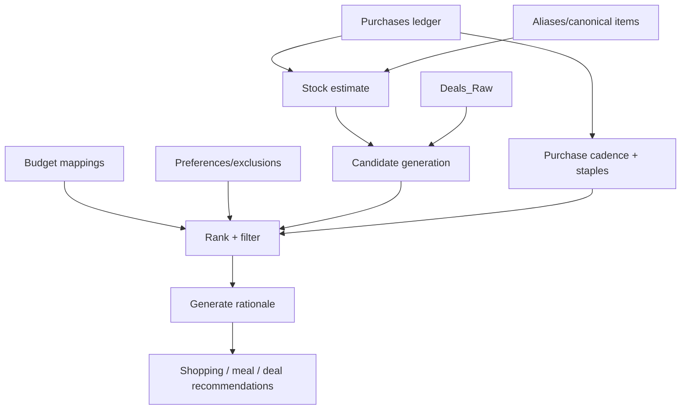

# Recommendation Engine Architecture

The recommendation engine produces explainable shopping, meal, and deal suggestions from authoritative purchases, derived stock estimates, raw deals, budget constraints, and user preferences.

## Goals

- Suggest useful replenishment items
- Suppress items likely already stocked
- Prioritize expiring or aging food for meal planning
- Match deals to actual household patterns
- Explain every recommendation
- Keep recommendations advisory, not authoritative

## Non-goals

- Fully autonomous purchasing
- Exact nutrition optimization
- Medical or dietary advice
- Silent mutation of purchases or stock
- Black-box recommendations without rationale

## Inputs

| Input | Role |
| --- | --- |
| `Purchases` | Authoritative history of acquired items |
| `Stock` | Coarse current inventory estimate |
| `Deals_Raw` | Possible current promotions |
| `Aliases` | Canonical item/category metadata |
| Budget mappings | Monthly category constraints |
| Manual preferences | Likes, dislikes, staples, exclusions |
| Meal plan hints | Optional target meals or cuisines |

## Outputs

Recommended output surfaces:

- `Shopping_List` later, or generated report first
- meal suggestion report
- deal matching report
- budget impact summary

Suggested recommendation fields:

| Field | Description |
| --- | --- |
| `recommendation_id` | Stable ID for generated recommendation |
| `type` | `replenish`, `use_soon`, `deal_match`, `meal_idea`, `budget_warning` |
| `canonical_item_id` | Related canonical item if applicable |
| `title` | Human-readable recommendation |
| `priority` | `high`, `medium`, `low` |
| `confidence` | 0.0-1.0 |
| `rationale` | Explanation shown to user |
| `inputs_used` | Source rows/rules used |
| `action` | Suggested user action |
| `expires_at` | Optional expiry for deal/time-sensitive recs |

## Architecture

## Candidate generation

Generate candidates from:

1. low/none stock states for staples
2. aging perishables for use-soon meals
3. deals matching staples or planned meals
4. recurring purchase cadence gaps
5. budget category anomalies

## Ranking signals

Positive signals:

- item is a staple
- stock state is `none` or `low`
- historically purchased frequently
- deal is materially cheaper than usual
- item supports planned meals
- item uses aging perishables

Negative signals:

- stock state is `stocked`
- item rarely purchased
- item is perishable and already recently bought
- deal is noisy or irrelevant
- budget category is already high for the month
- confidence is low

## Recommendation types

### Replenishment

Suggest when staple stock is `low` or `none`.

Example rationale:

> Buy milk because it is a staple, last purchased 10 days ago, and current stock estimate is low.

### Use-soon / meal ideas

Suggest meals based on aging perishables and available staples.

Example rationale:

> Consider stir fry because tofu and broccoli were purchased recently and broccoli is approaching its freshness window.

### Deal matching

Suggest when a deal matches a staple, low-stock item, or planned meal.

Example rationale:

> Cat litter deal may be useful because purchase cadence suggests it will be needed within two weeks.

### Budget warning

Warn when current spend exceeds expected period pacing.

Example rationale:

> Household supplies are above expected monthly pace due to detergent and paper goods purchases.

## Explainability rule

Every recommendation must answer:

- why this item?
- why now?
- what evidence was used?
- how confident is the system?
- what would make the recommendation wrong?

## Safety and privacy boundaries

Recommendations should avoid sensitive inferences unless explicitly enabled.

Examples:

- Do not surface pharmacy/health-related patterns as casual recommendations
- Do not infer medical conditions from purchases
- Do not recommend exact nutrition interventions from receipt data
- Do not expose one household member's sensitive purchases to another without household policy

## MVP implementation

Initial MVP can generate a Markdown report from Sheets:

1. Read `Purchases`, `Stock`, `Deals_Raw`, and budget mappings
2. Generate candidates
3. Filter obvious suppressions
4. Rank by simple weighted score
5. Emit recommendations with rationale
6. Require user review before adding to an actual shopping list

## Future implementation

Later versions may add:

- explicit `Shopping_List` tab
- preference profiles
- household member scopes
- price history analytics
- recurring meal planning
- web recipe search integration
- calendar-aware shopping planning
